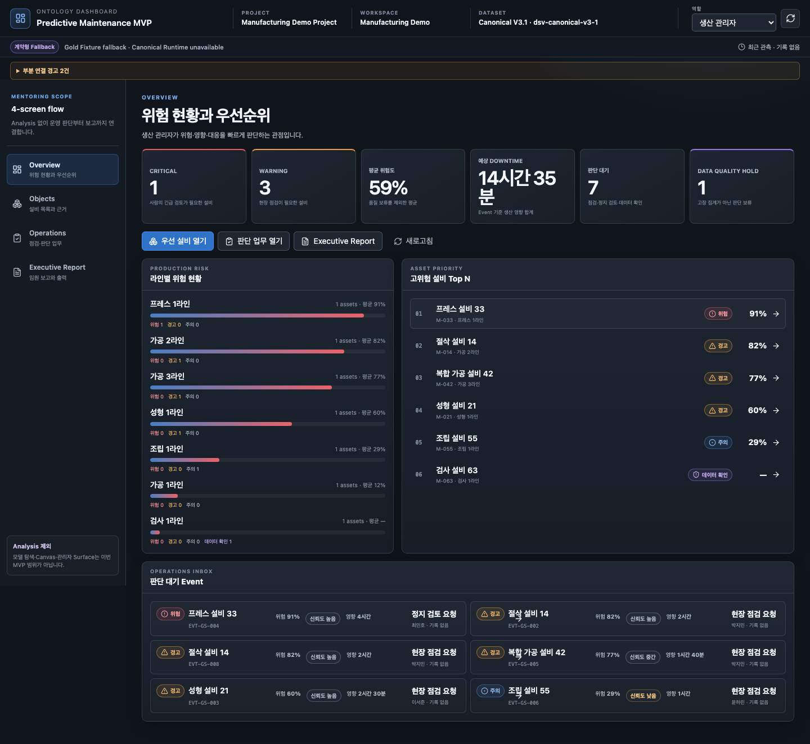
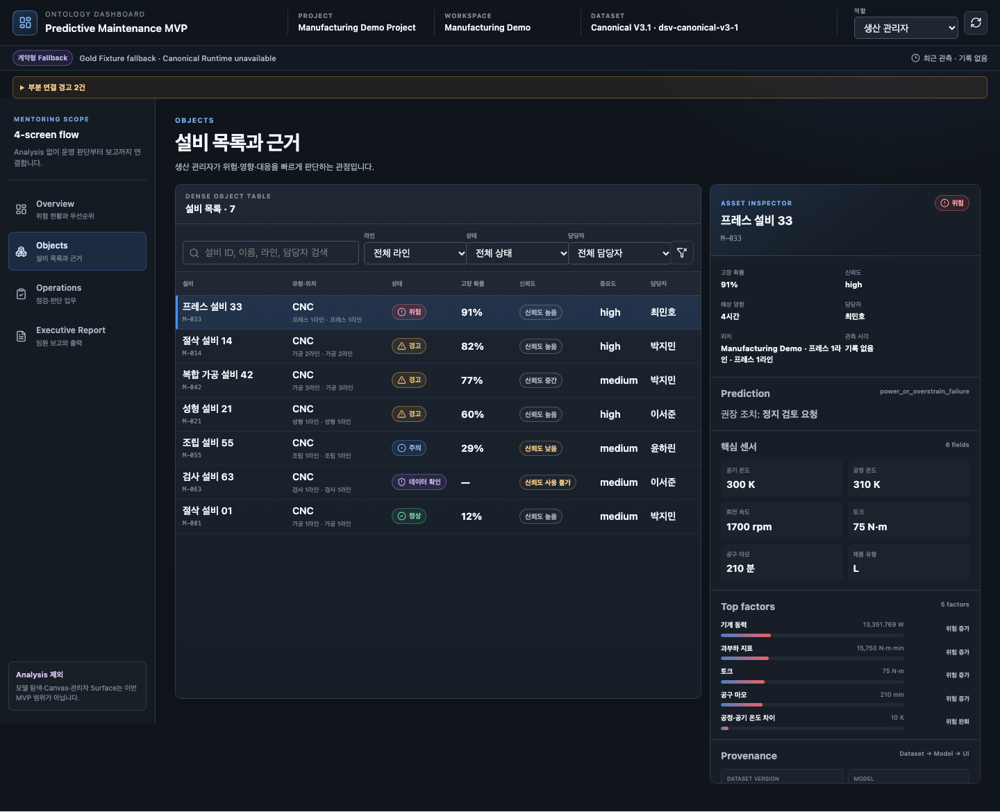
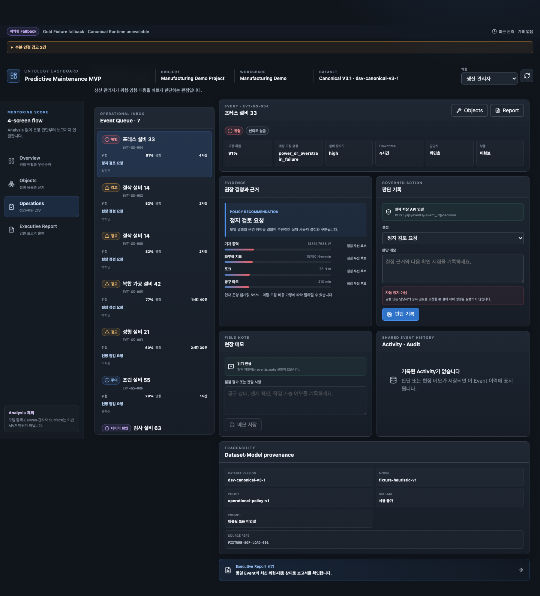
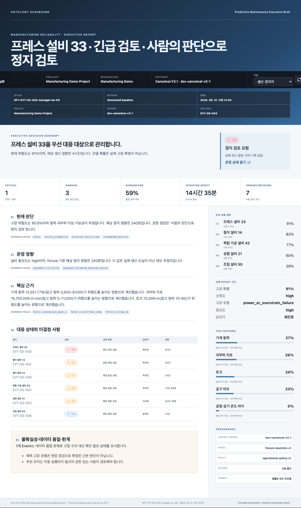
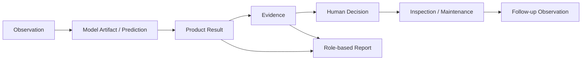

# Ontology Dashboard — 제조 설비 의사결정 지원

설비의 이상 가능성을 예측하는 데서 끝나지 않고, **예측 결과 → 근거 → 사람의 판단 → 정비 Action → 보고**까지 하나의 사건(Event)으로 연결하는 제조 Reliability Operations 프로젝트입니다.

팀 프로젝트이며, 저는 **Backend Intelligence & Dynamic Reporting** 축에서 Runtime Result/Evidence와 AI 설명·보고의 grounding 및 검증 규칙을 담당했습니다.

## 실제 화면

<p align="center">
  
  
</p>

<p align="center">
  
  
</p>

> README용 GIF는 실제 화면에서 **Overview → 설비 상세 → Decision Case → Report** 흐름을 짧게 녹화해 위 영역의 대표 이미지 하나와 교체하는 방식이 가장 적합합니다.

## 한눈에 보기

| 항목 | 내용 |
| --- | --- |
| 문제 | 예측 점수만으로는 현장 담당자가 왜 점검해야 하는지, 어떤 Action을 해야 하는지 판단하기 어려움 |
| 제품 흐름 | Observation → Model Result → Evidence → Decision → Action → Report |
| 핵심 원칙 | 같은 Event와 Evidence를 역할별 화면과 AI 설명이 공유 |
| AI 역할 | 판단을 대신하지 않고 Evidence 기반 설명과 보고를 보조 |
| 팀 구성 | ML / Backend Intelligence / Ontology Operations / Product Integration 4개 책임 축 |

## Product Flow



핵심은 “AI가 고장을 확정한다”가 아니라, **누가 어떤 근거로 무엇을 판단했고 이후 어떤 Action과 결과가 연결됐는지 추적할 수 있게 하는 것**입니다.

## 역할별 화면

### Engineer
- 설비 위험 요인
- 센서 / feature 근거
- 점검 대상
- 모델 provenance

### Operations
- Decision Case
- 판단 대기
- 생산 영향
- 점검 / 정비 Action
- Closed-loop activity

### Executive
- 전체 리스크
- 생산·재무 영향 추정
- 의사결정 병목
- Report readiness

모든 화면은 서로 다른 정보를 보여주지만 같은 Event lineage를 기준으로 합니다.

## AI 설명 파이프라인

단순히 모든 운영 기록을 LLM에 전달하지 않고, 선택한 Event와 같은 설비·시점의 근거를 먼저 구성한 뒤 필요한 정보만 전달합니다.

```text
Prediction Result
      ↓
same Event / same Asset / same Time
      ↓
Evidence selection
      ↓
LLM explanation
      ↓
content / scope validation
      ↓
Dashboard / Report
```

근거가 없거나 검증 기준을 통과하지 못하면 임의의 내용을 채우는 대신 보류·fallback 상태를 사용합니다.

## 검증 결과

동일한 8개 fixture를 15회씩 사용해 **pipeline 포함 방식 120회와 direct 방식 120회**를 비교했습니다.

| 지표 | Pipeline | Direct |
| --- | ---: | ---: |
| 공통 내용 검사를 통과한 후보 반환 | **97/120 (80.8%)** | **25/120 (20.8%)** |
| 차이 | **+60.0%p** | - |
| 중앙 지연 | 22.8초 | 10.2초 |

파이프라인은 역할별 필수 항목과 기록 범위를 검사하고, 기준을 만족하지 못한 후보를 재작성·거절했습니다.

다만 이 수치를 전체 품질 성공률이나 실제 현장 유용성으로 확대하지 않습니다. 원문 스키마와 날짜 표현 문제는 남았고, 실제 보전 담당자 사용자 평가는 별도 과제입니다.

- [120회 A/B 평가](./docs/eval/final-demo-evidence-20260908/pipeline-ab-summary-ko.md)
- [블라인드 에이전트 예비평가](./docs/eval/final-demo-evidence-20260908/blind-agent-eval-results-ko.md)

## System Responsibilities

```text
gen_data
  ↓
Generator
- Feature / Label
- Model training
- versioned Model Artifact
  ↓
Backend Runtime
- inference
- Product Result / Evidence
  ↓
Ontology Operations
- Decision
- Recommended Action
- Maintenance Action
  ↓
Frontend / Executive Brief / LLM Report
```

각 계층은 직접 구현에 강하게 결합하기보다 versioned Artifact와 Product API 계약으로 연결합니다.

## Team Responsibilities

| 역할 | 책임 |
| --- | --- |
| ML Lifecycle & Contract Engineering | Feature/Label, Model Artifact, 재현성 |
| **Backend Intelligence & Dynamic Reporting** | **Runtime Result/Evidence, grounded narrative, Report 검증** |
| Ontology Operations & Closed-loop | Decision, Action, Maintenance, feedback loop |
| Product AI & Integration | Frontend, LLM runtime integration, CI/E2E, deployment |

세부 역할은 [최종 역할 분배 및 실행 계획](./docs/final_team_role_and_step_plan.md)을 참고하세요.

## Local Run

전체 로컬 실행:

```bash
bash scripts/run_local.sh
```

PostgreSQL 기반 live runtime:

```bash
bash scripts/run_local_live.sh
```

Backend:

```bash
cd systems/backend
pip install -e ../../ml -e '.[dev]'
uvicorn app.main:app --host 0.0.0.0 --port 8000
```

Frontend:

```bash
cd systems/frontend
npm ci
npm test
npm run build
```

## Quality Gates

- architecture boundary verification
- generator contract / schema checks
- backend Result / Evidence tests
- Closed-loop Action API
- frontend unit / production build
- Playwright E2E
- Docker runtime smoke

```bash
python3 systems/verify_architecture.py
```

## Deployment

```text
GitHub Actions
      ↓
validated main SHA
      ↓
Mac mini release watcher
      ↓
Frontend / Backend runtime
      ↓
Cloudflare Tunnel
```

배포와 운영 상세는 [free demo stack](./docs/deployment/free-demo-stack.md)을 참고하세요.

## Repository Guide

```text
systems/generator/     feature / training / artifact
systems/backend/       runtime inference / product API
systems/frontend/      role-based product UI
contracts/             shared contracts
docs/                  architecture / operations / evaluation
evaluation/            evaluation code and outputs
```

## Known Limits

- 실제 보전/공정 담당자 대상 사용자 평가는 아직 별도 검증이 필요합니다.
- 생산·재무 영향은 실제 회계 손실이 아니라 의사결정용 추정치입니다.
- Assistant/LLM은 사람의 승인·정비 판단을 대신하지 않습니다.
- 정비 완료 기록만으로 정상 상태를 확정하지 않고 후속 Observation과 Prediction을 다시 확인합니다.

## Documents

- [프로젝트 문서 인덱스](./docs/README.md)
- [시스템 아키텍처](./docs/architecture.md)
- [Operations 문서](./docs/operations/README.md)
- [발표 데모 흐름](./docs/presentation-demo-flow.md)
- [Architecture Decision Records](./docs/architecture-decisions/README.md)
