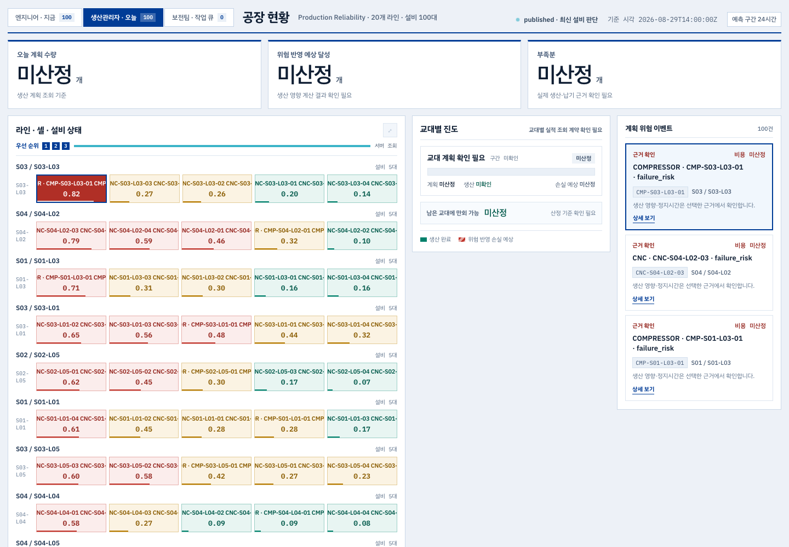
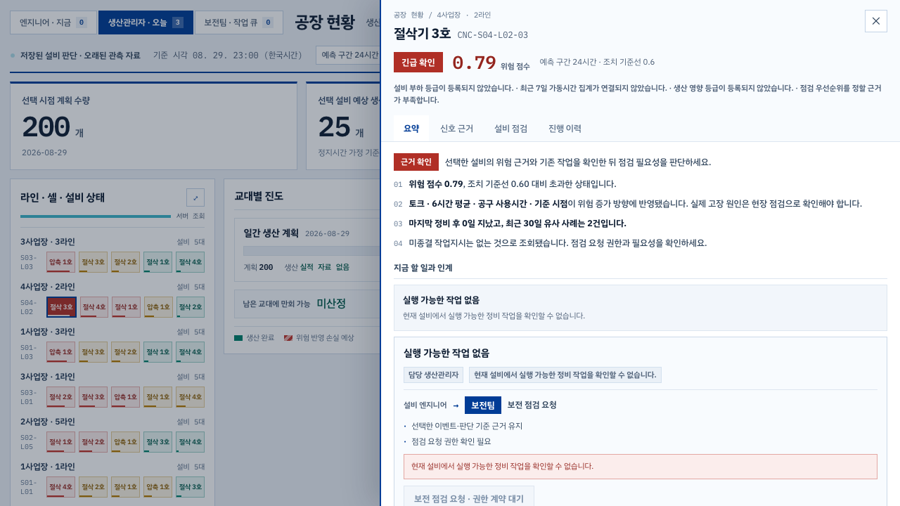

# 독립 공장 현황 페이지 연결 검증 — 2026-09-06

## 결과와 범위

기존 HTML의 템플릿·스타일과 필수 support.js를 선택 복사해 독립 Vite HTML entry로 연결했다. 부모 React 페이지나 iframe 없이 인증된 API를 직접 호출한다. 기존 support.js 자체의 React 18 템플릿 렌더러는 그대로 사용한다. 기존 React 앱으로 컴포넌트를 이식한 구현은 아니다.

기준 커밋: `f89da53afc274be87d2155172aad083f2bf50ddb`. 작업 브랜치: `codex/standalone-factory-main`. 시작 시 저장소의 미커밋 변경이 없음을 확인했다. 별도 작업 복사본 전체를 덮어쓰지 않았다. 이번 변경에는 Backend 업무 계약 변경이 없다.

## 접속과 실행

현재 검증용 로컬 프로세스가 실행 중인 동안 다음 주소를 사용할 수 있다.

- 빌드 결과 + Nginx: http://127.0.0.1:13311/
- 개발 서버: http://127.0.0.1:13310/
- 독립 페이지: `/factory-status-original/index.html`
- 기존 React 화면: `/app/projects/manufacturing-demo-project/operations`
- 로그인: `/login`. 기본 목적지는 독립 페이지이며 기존 앱으로의 명시적인 returnTo는 유지된다.

상단 사업장 이름을 누르면 프로젝트·워크스페이스 선택, 새로 조회, 기존 앱, 로그아웃을 사용할 수 있다. 설비 타일을 선택하고 다시 누르면 기존 공통 사이드뷰가 열린다. URL에는 project/workspace/asset/event/snapshot/asof가 저장된다. 잘못된 snapshot은 다른 snapshot으로 자동 대체하지 않는다.

개발 실행은 기존 PostgreSQL Backend를 준비한 뒤 저장소 루트에서 아래와 같이 한다. Backend 인증·데이터·환경 변수는 기존 프로젝트 구성을 사용한다. SQLite로 대체하지 않는다.

```sh
cd systems/frontend
npm ci
VITE_API_BASE_URL='' VITE_API_PROXY_TARGET=http://127.0.0.1:8000 npm run dev -- --host 127.0.0.1 --port 13310
```

Backend를 다른 포트로 실행했다면 `VITE_API_PROXY_TARGET`을 맞춘다. 이번 검증 API는 18310이었다. 기존 운영용 DB 대신 별도 PostgreSQL 컨테이너 `ontology-standalone-page-pg`의 로컬 복제본을 사용했다. 기존 `ontology-backend-integration-pg`는 읽기 복사만 했다. 복제 데이터는 프로젝트의 로컬 runtime 데이터이며 실제 공장 운영 성능의 증거가 아니다.

배포 빌드:

```sh
cd systems/frontend
VITE_API_BASE_URL='' npm run build
```

`dist`에 기존 index.html과 `factory-status-original/index.html`, support.js, 고정 버전 vendor, 번들 자산이 함께 생성된다. `systems/frontend/nginx.conf`는 `/`를 독립 페이지로 보내고 `/api/`를 `backend:8000`으로 전달한다. `/login`과 `/app/...` 새로고침은 기존 index.html로 처리한다. Dockerfile과 기본 Compose의 API 기본값도 같은 origin을 사용한다. 별도 API URL을 강제로 지정하면 해당 배포의 cookie/CORS/CSP 구성이 추가로 필요하므로 이번 검증 범위에 포함하지 않는다.

Nginx 검증 컨테이너 `ontology-standalone-page-web`는 실제 dist와 저장소 Nginx 설정을 사용하되 로컬 Backend 연결 주소만 `host.docker.internal:18310`으로 바꿨다. 원격 서버 배포 및 전체 Docker 이미지 재빌드는 수행하지 않았다.

## 연결 API

| 용도 | 경로 |
| --- | --- |
| 인증·세션 | `/api/auth/me`, `/api/auth/login`, `/api/auth/logout`, `/api/auth/active-project` |
| 프로젝트·워크스페이스 | 기존 `getProjects`, `getProject`, `getProjectWorkspaces` API |
| 초기 목록 | 기존 predictive-maintenance dashboard, results/latest API. 기존 fallback 출처·경고 유지 |
| 상세 | `/api/objects/{asset}/detail-view` |
| 구조화된 운영 맥락·생산 영향 | `/api/objects/{asset}/operational-context` |
| 정비 이력 | `/api/projects/{project}/workspaces/{workspace}/maintenance/events/{event}/lineage` |
| Backend 후보 | 동일 maintenance 아래 `inspection-results/{result}/action-candidates` |
| 후속 결과 | 기존 predictive-maintenance 아래 `results/post-maintenance` |

저장 어댑터는 maintenance 아래 `recommendations/{id}/decisions`, `maintenance-work-orders/{id}/approve`, `maintenance-actions/{id}/start`, `maintenance-actions/{id}/complete`에 연결했다. 추천 채택과 WorkOrder 승인은 서로 다른 명시적 명령이다. 실제 계정 역할·permission과 상세 ViewModel의 `available_actions`가 모두 허용해야 실행한다. CSRF cookie/header, session cookie, Idempotency-Key를 사용하고 저장 직전 snapshot 및 허용 액션을 재확인한다. 성공 후 목록·상세를 재조회하며 409는 성공으로 표시하지 않는다. 새 LLM 보고서를 생성하거나 외부 LLM을 호출하지 않는다.

## 미지원 및 Backend 후속 작업

- **현재 runtime 상세에 정비 `available_actions`가 제공되지 않아 실제 저장은 비활성이다. 실제 Backend 정비 저장 완료를 주장할 수 없다.** 연결한 저장 어댑터의 서버 성공·충돌·중복 방지는 아래 모의 응답 검증에 한정된다.
- 엔지니어의 점검 요청, 보전팀의 점검 수락·시작·결과 기록은 현 서버 역할 계약과 다르므로 비활성 사유를 표시한다. 역할 탭은 실제 계정 권한을 변경하지 않는다.
- Backend 후속: event/snapshot/project/workspace/대상/현재 상태와 연결된 역할별 허용 액션 제공, 목표 점검 역할 계약 반영 및 서버 거부·충돌·snapshot 테스트가 필요하다. 프런트의 저장 전 재조회는 서버의 원자적 검증을 대체하지 않는다.
- 신규 후보 기반 정비안 생성은 비용 분석 참조의 저장 계약 연결 전이다. 후보 조회와 생산 영향은 읽기 전용이다.
- 일정·예상 정지시간·착수 조건 입력 저장 및 생산 대응 실행은 미지원이다. 임의 계산이나 메모로 정상·회복 상태를 만들지 않는다.
- 후속 관측·재예측 조회는 구현됐지만 해당 결과가 있는 실제 저장 시나리오 전체는 검증하지 않았다. 정비 완료를 이상 해소나 생산 회복으로 표시하지 않는다.

## 검증 증거

- `npm run build`: 통과. 필수 support.js는 public 파일로 복사되므로 Vite의 classic script 비번들 경고는 의도된 구성이다. 기존 큰 번들 경고도 남아 있다.
- adapter + routing 단위 테스트: **20 passed** (`unit-tests.txt`).
- 개발 서버 브라우저: **9 passed** (`browser-tests.txt`).
- 빌드 Nginx 브라우저: **9 passed** (`production-browser-tests.txt`).
- 각 9개 구성: PostgreSQL Backend 실조회 6개, 실제 조회에 응답 지연을 주입한 경쟁 상태 1개, 저장 API 모의 응답 200/409 각 1개. 9개 모두를 실제 저장 검증으로 해석하지 않는다.
- 실조회 검증: `/`→로그인→독립 페이지, 세 역할, 탭 전환 시 권한 불변, 설비 선택·사이드뷰, 새로고침·직접 URL, 잘못된 snapshot 차단, 기존 React 경로.
- technician seed 계정은 maintenance_technician과 process_engineer 복수 역할을 가진 기존 테스트 계정이다. 화면에서 실제 primary 역할을 maintenance_technician으로 표시한 검증이며, 순수 단일 역할 technician 계정까지 검증한 것은 아니다.
- 모의 저장 검증: CSRF·Idempotency-Key 존재, 중복 요청 1회, 성공 후 재조회·새로고침, 충돌 시 성공 안내 없음.
- 원본과 같은 Backend payload, **1440×1000**에서 주요 header/section 위치·크기·font·background·gap 일치 (`design-comparison.json`). 픽셀 완전 동일성 검증은 아니다. 저장 상태 표시와 데이터 연결 문구는 수정 범위에 해당한다.





비교 재실행은 frontend에서 `ORIGINAL_HTML`과 `ORIGINAL_SUPPORT`를 원본 경로로 지정하고 `node scripts/compare-standalone.mjs`를 실행한다. 브라우저 검증은 `PLAYWRIGHT_EXTERNAL_SERVERS=1 PLAYWRIGHT_BASE_URL=http://127.0.0.1:13311 npx playwright test e2e/standalone-original.spec.ts --project=chromium`으로 실행한다. 기존 demo seed 계정이 있는 로컬 테스트 Backend가 필요하다.

## 9월 6일 추가 수정: 필드 매핑·한국어 현장 용어

앞선 진입 검증만으로 화면 매핑 완료를 판단한 것은 부정확했다. 실제 선택 설비 CMP-S03-L03-01의 응답을 화면 값과 대조해 아래를 수정했다.

| 화면 | 연결한 필드 / 표시 원칙 |
| --- | --- |
| 선택 설비 위험 점수 | 상세 `risk.current`, `risk.status_grade`를 사용. 초기 목록의 점수로 상세 값을 덮지 않음 |
| 관측 신호 | `sensors.historyPoints`의 실제 관측값을 그림. 최신 관측 시각과 건수 표시. 현재값이 없을 때 최근 관측임을 명시하고 단위를 임의 추정하지 않음 |
| 위험 판단 요인 | feature/label/value/contribution/direction 연결. 회전 신호 6시간 평균·절댓값 평균·변동폭 등 한국어 표시. 모델 변환값을 물리 단위로 표시하지 않음 |
| 기여값 | 원본 모델 기여값 표시. 퍼센트로 해석하지 않음. 막대 길이만 최대 절댓값 기준 상대 크기로 표현 |
| 생산 계획·품목 | 사용 가능한 planning 자료의 production_plan 또는 상세 operationContext.productionPlan 연결. 계획 수량 0도 보존. 일간 계획을 교대 실적으로 표시하지 않음 |
| 생산 차질 | 상세 eventImpact.estimatedLostUnits와 운영 맥락의 조건별 remaining_exposed_units 표시. 서버가 calculated로 반환한 값만 표시하며 실제 손실·회복으로 해석하지 않음 |
| 정비·생산 현황 | 최근 정비 경과일, 유사 사례, 미완료 작업지시, 정지 예상시간, 운영 자료별 상태·시연 자료 여부 연결 |
| 진행 단계 | 서버에 저장된 work_orders·maintenance_actions의 상태를 사용. 임의 완료 단계 생성 없음 |
| 요청 큐·진행 기록 | 요청 생성/갱신 시각 및 저장된 활동 연결 |
| 한국어 표시 | 공기압축기·전동기·고장 위험 감지·설비 엔지니어·보전 담당자·생산관리자·작업지시·판단 기준·표준작업서. 원본 식별자와 저장 payload는 유지 |
| 시각 | 화면은 한국시간 월/일 시/분. URL과 API의 원본 시간대 값 유지 |

실제 로컬 PostgreSQL 응답에서 관측 신호 4개는 각 144개 이력이 확인됐다. 반면 동일 설비·시점의 operationContext는 일치하는 생산 자료가 없음을 반환했고, 별도 operational-context 조회는 404였다. 해당 생산 수치가 실제 API로 표시된다는 주장은 하지 않는다. 생산 매핑은 사용 가능한 계약 데이터를 넣은 단위 테스트로 검증했으며, 이를 채우기 위한 데이터 생성·다른 시점 자료 대체·Backend 권한 변경은 하지 않았다.

추가 증거: `mapping-unit-tests.txt`, `mapping-build.txt`, `mapping-browser-tests.txt`, `mapping-engineer.png`. 기존 레이아웃을 유지하고 데이터 바인딩·문구·빈 자료 안내만 수정했다.

추가 수정 최종 결과: 매핑·라우팅 단위 테스트 14개 통과, 빌드 통과, Nginx 브라우저 10개 통과(실제 PostgreSQL 조회 7개 + 응답 지연 주입 1개 + 저장 모의 응답 2개). 실제 렌더링 루트에서 한국어 신호명·관측 이력·사이드뷰 출처 도움말을 확인했다. 100대 목록의 위험 요인에 나온 30종 지표명을 대조했다. 같은 설비 사이드뷰를 열 때 선택 기준 URL을 지우던 문제도 수정했다. 현재 페이지를 새로고침하면 빌드된 수정 화면을 볼 수 있다.

## 첨부 화면 기준 현장 브리핑 매핑

- 기본 모드를 중앙 근거 확대 상태로 변경했다. 왼쪽 설비 맵·중앙 판단 근거·오른쪽 이벤트의 원본 구조를 사용한다.
- 지도에는 절삭 n호/압축 n호, 상세에는 절삭기/공기압축기와 원본 설비번호를 병기한다. 호수는 원본 ID의 끝 번호이며 셀 범위의 표시 별칭이다. 설비를 새로 생성하거나 ID를 바꾸지 않는다.
- 중앙 네 문단: 점수와 실제 기준선 비교, 위험 증가에 반영된 신호, 정비 경과와 유사 사례, 미종결 작업지시 확인. 제공되지 않은 추세 반전 시각·정비 경과·임계값은 만들지 않는다.
- 중앙 여섯 항목: 마지막 정비 경과 / 30일 유사 사례 / 미종결 작업지시 / 설비 중요도 / 예측 구간 / 설비 종류.
- 이벤트 제목은 위험 상태와 실제 위험 요인, 위치와 설비명, 다음 근거 확인 동선으로 연결한다. 조회된 최신 상태를 위험 등급에 새로 진입한 사건이라고 표현하지 않는다.
- 실제 공정명이 등록돼 있지 않은 Sxx/Lxx는 사업장·라인 번호로 표시한다. 첨부 시안의 화성·프레스·가공·조립 명칭과 24대·50개 같은 숫자는 복사하지 않는다.
- 가동 정보가 없으므로 조회된 100대를 가동 중 100대로 간주하지 않는다. 가동 중 설비는 미확인으로 표시한다.

단위 테스트 설정이 .ts만 포함해 앞선 .js 매핑 테스트를 일부 실행하지 않은 점도 수정했다. 최신 `field-brief-tests.txt`의 **3개 파일·17개 테스트**가 실제 실행 결과다. 이전 14개 통과 설명 대신 이 결과를 기준으로 한다. `field-brief-browser.txt`는 실제 페이지의 중앙 여섯 항목·현장 설비명까지 검증한다.

## Backend 연결 수정 브리핑

원인: 운영 자료 API의 사전 검증은 producer Artifact 조회만 사용했고, 현재 Canonical prediction contract를 읽는 경로는 상세 API에만 있었다. 또한 runtime 상세 구성은 maintenance_context를 세 항목 모두 null, equipment_history를 빈 목록으로 넘기고 있었다. DB 정비 기록 적재 여부와 무관하게 화면이 비는 구조였다.

수정:

1. 운영 자료 사전 검증에서 같은 runtime 결과 목록을 읽고 선택 설비·근거 ID·판단 시점을 검증한다. 다른 근거로 바뀌면 409로 거부한다. producer Artifact인 것처럼 형식을 바꾸지 않는다.
2. 정비 원천 기록을 조직·프로젝트·워크스페이스·데이터 버전·설비로 제한하고, 판단 시점 이전에 완료된 기록만 상세 ViewModel에 전달한다.
3. 작업지시는 판단 시점 전에 생성된 것만 조회한다. 이후 변경된 현재 상태로 과거 상태를 추정하지 않고 미확인 처리한다. 유사 사례 수는 정의·조회 연결이 없으므로 null을 유지한다.
4. 정비 조회 자체가 실패하면 경고를 반환하며 0건이나 정상으로 표시하지 않는다. 위험 점수·정비 승인·실행 권한은 변경하지 않는다.

실제 로컬 PostgreSQL 결과: CMP-S03-L03-01, 2026-08-29 23:00 한국시간 기준 운영 자료 조회 오류 해소. 마지막 정비 이후 20일, 2026-08-09 완료 이력 1건, 미종결 작업지시 없음. `backend-live-connection.json` 참조. 운영 Context는 200 응답에 `not_connected`와 명시적 원인 코드를 반환한다.

남은 자료: 운영 Context 14건은 다른 8대 설비에 대한 자료이며 선택 압축기의 적재 자료는 없다. 따라서 생산 계획·차질 수치가 채워진 것은 아니다. 기존 시연 자료를 날짜나 설비만 바꿔 재사용하지 않았다. 신규 작업지시·역할 정책·생산 일정 실행 기능은 이번 읽기 연결 수정에 포함하지 않는다.

Backend 관련 검증: `backend-connection-tests.txt` 52 passed / 3 skipped. SQLite 계약 검증 및 기존 API 회귀를 포함한다. PostgreSQL 실제 동작은 별도 JSON·브라우저 결과로 구분한다.
