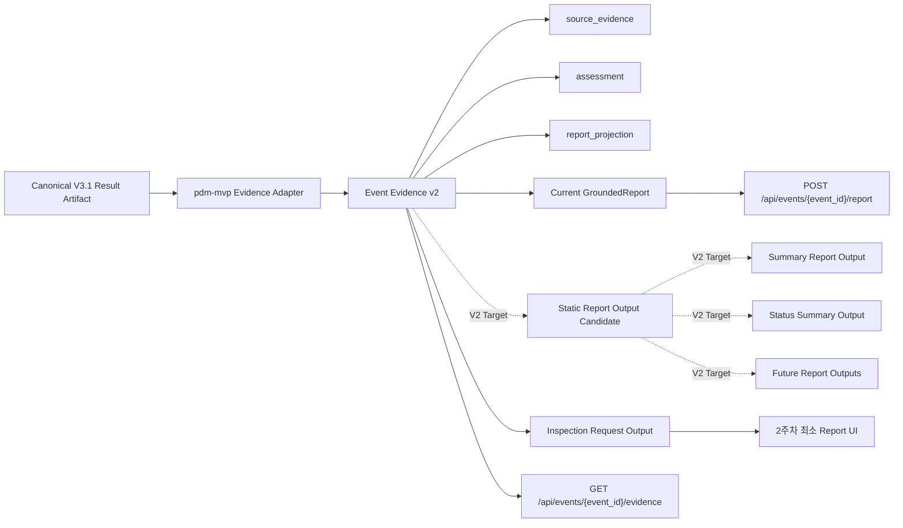

# PdM Evidence Package와 Report UI 통합 계획

작성일: 2026-08-10
상태: 제안
범위: `ontology-dashboard`의 현행 fixture 기반 dashboard Evidence Package를 `pdm-mvp` Evidence Package를 source contract로 하는 Event Evidence v2로 대체하고, `map-report-ui-prototype`에서 확인한 화면 필드 중 2주차 MVP에 필요한 근거 추적과 점검 요청 액션만 최소 이식하기 위한 구현 계획이다.

여기서 "대체"는 `pdm-mvp` 원본 payload를 dashboard evidence 루트에 그대로 덮어쓴다는 뜻이 아니다. 원천 Evidence와 화면/리포트 projection을 분리해 `source_evidence`, `assessment`, `report_projection`, `provenance` 같은 명시적 계층으로 재구성한다.

## 1. 확인된 현재 기준선

- `ontology-dashboard`는 제품 API, 프론트엔드, 역할별 리포트 스키마, MVP 화면을 담당한다.
- `pdm-mvp`는 Canonical V3.1 Result Artifact를 Evidence Package로 변환하는 생산자와 deterministic 역할별 리포트 블록을 담당한다.
- `pdm-mvp`는 최종 화면이 아니라 화면이 소비할 데이터 계약, 근거 패키지, 매니저/엔지니어 리포트 블록을 보유한다.
- `pdm-mvp/report_generator.py`는 판단 억제 로직 없이 사실을 제시하며, optional context가 없으면 값을 임의 생성하지 않고 `근거 부족` 블록으로 남긴다.
- `pdm-mvp/scripts/load_v3_result_artifacts.py`는 자산 유형별 센서 스키마, 동종 집단 비교, 정비 문맥, top factor 기반 `component_hypotheses`, 규칙 기반 `failure_type_candidates`, lineage를 생성한다.
- 현행 Event API 경계는 다음과 같다.
  - `GET /api/events/{event_id}/evidence`
  - `POST /api/events/{event_id}/report`
- 현행 dashboard evidence schema는 fixture 중심 구조다. 주요 필드는 `equipment`, `observation`, `history`, `top_factors`, `maintenance_context`, `lineage`다.
- `pdm-mvp` Evidence Package는 Result Artifact 중심 구조다. 주요 필드는 `asset_id`, `sensor_evidence`, `model_prediction`, `top_factors`, `maintenance_context`, `recommended_actions`, `status_flags`, `lineage`다.
- `map-report-ui-prototype`은 정적 React 프로토타입이다. 2주차에는 화면별 필요 필드 후보를 역추적하는 참고 자료로만 사용하고, 하드코딩된 데이터 생성 로직은 제품 데이터 소스가 될 수 없다.

## 2. 목표 방향

`pdm-mvp`를 Result Artifact와 Evidence Package의 source contract로 사용하고, 현행 fixture 기반 dashboard Evidence Package는 Event Evidence v2로 대체한다. 제품 API, 권한, 화면, report endpoint 경계는 `ontology-dashboard`가 유지한다.

프론트엔드는 raw JSONL이나 producer 원본 payload를 직접 파싱하지 않는다. 기존 API/service 계층이 안정적인 Event Evidence v2, 현행 GroundedReport, Report UI ViewModel을 만들어 제공한다.

Report 생성은 단일 화면에 바로 붙는 구조가 아니라 다음 계층을 분리한다. 2주차 구현 범위는 1~3번까지다.

1. `pdm-mvp` Evidence Package를 `source_evidence`로 보존한다.
2. `source_evidence`에서 dashboard Event Evidence v2의 `assessment`와 `report_projection`을 만든다.
3. Event Evidence v2에서 현행 `GroundedReport`, 점검 요청 ViewModel, Evidence trace ViewModel을 파생한다.
4. 상태 요약, 기간 요약 보고서, 확장 report UI output은 V2 Target으로 보류한다.

따라서 Event Evidence v2가 우선 안정화 대상이며, 정적 Report Output 후보와 기간 기반 report views는 downstream 확장 후보로만 둔다.

### 2.1 도메인 분리와 채택 상태

이번 통합은 모든 dashboard 도메인 계약을 새로 정의하지 않는다. 기존 dashboard 문서의 Current/V2 분리를 따르고, `pdm-mvp`는 Prediction/Evidence 도메인의 source contract로만 사용한다.

| 도메인 | Source of truth | 이번 계획의 처리 | 상태 |
|---|---|---|---|
| Prediction / Evidence | `pdm-mvp` Result Artifact와 Evidence Package | Event Evidence v2의 `source_evidence`, `assessment`, `report_projection`으로 변환 | 1차 구현 대상 |
| Asset / Object | dashboard ontology/runtime 조회 | `asset_id`, 표시명, line, 담당자 같은 결합 필드는 있으면 연결하고 없으면 임의 생성하지 않음 | 현행 API와 결합 |
| Overview / Aggregate | dashboard 조회·집계 API | 2주차 계획에서 새로 설계하지 않음. 상태 분포, 전체 설비 수, top risk list는 V2 `ReportInput` 후보로 보류 | V2 Target |
| Operations | 현행 Event action/note/activity, 이후 production/maintenance API | 2주차에는 `정비이력 추가`를 별도 Operations 도메인 API가 아니라 Event action/note/activity에 연결하는 최소 액션 초안으로만 정의 | 최소 액션 초안 |
| Report | 현행 `GroundedReport`, V2 `ReportInput`/`ReportOutput` 후보 | Event Evidence v2는 현행 Event Report로 변환하고, 기간 기반 ReportOutput은 검증된 집계 입력이 있을 때만 파생 | Current + V2 Target 분리 |

따라서 Operations 도메인의 `production_cycle_count`, `maintenance_event_count`, 기간별 정비 목록, 운영 영향 집계는 이번 주 설계하지 않는다. 화면에 정비 문맥이 필요하면 `pdm-mvp.maintenance_context`를 근거로 표시하고, 사용자가 남기는 정비 기록은 현행 Event action/note/activity 흐름에 연결한다. 숫자를 0이나 추정값으로 채우지 않는다.



## 3. 반드시 지킬 경계

- `evaluation_truth`와 `hidden_truth`는 dashboard, API, LLM 입력, Evidence Package, frontend ViewModel에 노출하지 않는다.
- `review_shutdown`은 자동 설비 정지가 아니다. 사람의 정지 검토 요청으로만 표현한다.
- 리포트 추천으로 Work Order를 자동 생성하지 않는다.
- 단일 Evidence Package를 기간 기반 Executive Report로 취급하지 않는다. 기간 합계, 운영/비운영 설비 수, 정비 건수, site/cell 집계는 별도 집계 소스가 필요하다.
- 2주차에는 Operations 도메인의 생산·정비 기간 집계 계약을 새로 정의하지 않는다. Event Evidence v2 adapter가 `production_cycle_count`, `maintenance_event_count`, 운영 영향 수치를 만들지 않는다.
- 이 작업에서 현행 Event Report 계약을 V2 기간 기반 Executive Report 계약으로 대체하지 않는다.
- `pdm-mvp`가 `근거 부족`으로 남기는 optional context를 dashboard adapter가 임의 수치나 정상 상태로 보정하지 않는다.
- `failure_type_candidates`는 측정값에 대한 규칙 기반 조건 판정이며 모델 출력이 아니다. `predicted_failure_type` 또는 root cause처럼 취급하지 않는다.

## 4. 계약 병합 설계

### 4.1 Product Result Artifact

`schemas/product-result-artifact.schema.json`은 Canonical V3.1 runtime output과 맞춘다.

필수 확인 필드는 다음과 같다.

- `artifact_id`
- `asset_id`
- `asset_type`
- `observed_at`
- `prediction_horizon_hours`
- `prediction_task=binary_failure_within_horizon`
- `failure_probability`
- `predicted_failure_type`
- `status_grade`
- `confidence`
- `top_factors`
- `recommended_action`
- `provenance`

구현 시 검증해야 할 조건은 다음과 같다.

- `provenance.canonical_source_mutated=false`
- `prediction_task=binary_failure_within_horizon`
- `schema_version=result-artifact-v1.0`
- runtime payload에 evaluation-only 필드가 없음

### 4.2 Event Evidence v2

현행 fixture 기반 `schemas/evidence-package.schema.json`은 dashboard Evidence Package 역할을 해 왔지만, 실제로는 리포트 입력과 화면 표시용 값이 섞인 구조다. 이 작업에서는 이를 `pdm-mvp` Evidence Package를 source contract로 하는 Event Evidence v2로 대체한다.

Event Evidence v2는 다음 계층을 분리한다.

- `event_id`, `scenario_id`: 제품 Event 식별자
- `subject`: 설비 식별 및 표시명
- `assessment`: 상태, 확률, 신뢰도, 권장 판단
- `source_evidence`: `pdm-mvp` Evidence Package 원본 또는 무손실 핵심 보존
- `report_projection`: report/UI가 바로 쓰는 표시용 근거 카드, 점검 target, sensor card
- `provenance`: dataset/model/prediction/artifact/source reference
- `limitations`: 고장 미확정, 자동 정지 아님, 데이터 품질 한계

`source_evidence`가 보존해야 할 producer 원천 필드는 다음을 포함한다.

- `asset_id`
- `asset_type`
- `observed_at`
- `prediction_horizon_hours`
- `sensor_evidence`
- `model_prediction`
- `top_factors`
- `component_hypotheses`
- `maintenance_context`
- `recommended_actions`
- `status_flags`
- `lineage`

`assessment`와 `report_projection`이 파생해야 할 제품 필드는 다음을 포함한다.

- `event_id`
- `scenario_id`
- `subject` 또는 `equipment`
- `status`
- `recommended_decision`
- `confidence`
- `failure_probability`
- `threshold`, 있으면 보존하고 없으면 임의 생성하지 않음
- `detected_interval`
- `data_quality_warnings`

권장 구조는 producer evidence를 `source_evidence` 아래 보존하고, 프론트엔드 표시용 필드는 adapter가 `assessment`와 `report_projection`으로 파생하는 방식이다. `pdm-mvp` 원본 필드와 화면 표시용 필드를 같은 루트에 섞지 않는다.

### 4.3 Report Output 계층

현행 `schemas/report.schema.json`의 role-aware grounded report와 V2 제안 `ReportOutput`은 구분한다.

- 현행 Event Report: `schema_version=1.0`, `GroundedReport`, `sections/actions/citations/limitations` 중심
- V2 정적 Report Output: `executive-report-v1.0`, `generation_method`, `evidence_references`, `provenance` 중심
- 2주차 최소 화면 output: 점검 요청과 evidence trace에 필요한 Event Evidence v2 기반 ViewModel
- V2 화면별 Report UI Output: 상태 요약, 요약 보고서, 향후 추가 report view에 맞춘 ViewModel

통합 작업에서는 Event Evidence v2를 먼저 안정화한 뒤, 현행 `GroundedReport` 호환 경로를 우선 연결한다. V2 정적 Report Output 후보는 문서상 후보로만 유지하고 2주차 구현 범위에 넣지 않는다.

```text
Event Evidence v2
→ Current GroundedReport
→ Inspection Request ViewModel
→ Evidence Trace ViewModel
→ Static Report Output Candidate (V2 Target)
→ Summary / Status Report ViewModel (V2 Target)
```

이 구조를 사용하면 2주차에는 Event Evidence v2와 현행 Event Report만 안정화하고, 이후 report 화면이 늘어날 때 source/projection 경계를 다시 흔들지 않고 ViewModel만 추가할 수 있다.

## 5. 백엔드 구현 계획

### 5.1 최소 샘플 fixture 추가

dashboard 테스트 fixture 영역에 `pdm-mvp` 샘플과 expected projection 샘플을 최소 단위로 추가한다.

- critical Result Artifact sample
- normal Result Artifact sample
- critical Evidence Package sample
- normal Evidence Package sample, 사용 가능한 경우
- expected Event Evidence v2 sample
- expected GroundedReport sample
- expected Report UI ViewModel sample, UI 이식 단계에서 추가

이 파일은 regression fixture이며 production data가 아니다. expected fixture는 원천 `pdm-mvp` payload를 검증 없이 재작성하지 않고, adapter 출력의 계약 회귀 테스트에만 사용한다.

### 5.2 Adapter 모듈 추가

작은 adapter 모듈을 추가한다.

`api/ontology_dashboard/pdm_evidence_adapter.py`

책임은 다음과 같다.

- raw `pdm-mvp` Evidence Package 또는 `GovernedProductResult`를 dashboard Event Evidence v2로 변환한다.
- lineage, prediction ID, artifact ID, model version, dataset version, source reference를 보존한다.
- source field를 frontend evidence field ID와 `report_projection` source reference로 매핑한다.
- `recommended_actions`를 action 실행 없이 `assessment.recommended_decision`으로 변환한다.
- 원본 numeric confidence는 보존하고, 화면 표시용 confidence는 별도로 정규화한다.
- `error_context`, `peer_comparison`, `maintenance_context`, `failure_type_candidates`가 없거나 unavailable인 경우 이를 `근거 부족` 또는 data-quality/evidence-gap 상태로 전달한다.

후보 함수는 다음과 같다.

```python
def pdm_evidence_to_event_evidence_v2(package: dict) -> dict:
    ...

def product_result_to_event_evidence_v2(result: GovernedProductResult, context: DatasetVersionRuntimeContext) -> dict:
    ...

def event_evidence_v2_to_grounded_report(evidence: dict, role: str, locale: str) -> GroundedReport:
    ...

def role_blocks_to_grounded_report(blocks: list[dict], evidence: dict, role: str, locale: str) -> GroundedReport:
    ...

def event_evidence_v2_to_report_view_model(evidence: dict, report: GroundedReport | None = None) -> dict:
    ...

# V2 Target. 2주차 구현 범위에서는 호출하지 않는다.
def static_report_output_candidate_to_report_view_models(output: dict, evidence: dict) -> dict:
    ...
```

### 5.3 Runtime Service 재사용

`api/ontology_dashboard/predictive_maintenance_runtime/service.py`에는 PostgreSQL Result Artifact row를 dashboard evidence/report payload로 변환하는 `_dashboard_detail` 경로가 이미 있다.

이 매핑을 service 내부에 계속 두지 말고 새 adapter를 호출하도록 분리한다.

현행 `/api/events/{event_id}/evidence`와 `/api/events/{event_id}/report`는 `api/ontology_dashboard/service.py`의 fixture service 경로도 사용한다. 1차 구현은 `api/ontology_dashboard/pdm_evidence_adapter.py`와 `api/ontology_dashboard/service.py`를 우선 대상으로 하고, `systems/backend/app/report/*` 스켈레톤 이관은 후속 작업으로 분리한다.

### 5.4 Report Generator 의미 병합

`pdm-mvp/report_generator.py`는 역할별 deterministic block의 의미 출처로 참고한다. 1차 구현에서 코드를 그대로 병합하지 않고, `ontology-dashboard`의 Event Evidence v2 projection과 현행 `GroundedReport` renderer로 재구성한다.

대상 블록은 다음과 같다.

- `manager`
- `engineer`
- block fields: `type`, `title`, `text`, `source_fields`

이 블록은 우선 Event Evidence v2의 `report_projection`과 현행 `GroundedReport` 호환 섹션으로 변환한다. V2 정적 Report Output은 그 다음 단계 후보로 둔다.

- `source_fields` -> `ReportSection.evidence_field_ids`
- `title` -> `ReportSection.title`
- `text` -> `ReportSection.body`
- mapped source field 기준으로 report citation 생성

LLM은 bounded renderer 또는 fallback으로만 둔다. 숫자 위험 판단이나 추천 실행의 주체가 되면 안 된다.

### 5.5 2주차 최소 Report/ViewModel 분기

Event Evidence v2의 `report_projection`을 기준으로 현행 `GroundedReport`, 점검 요청 ViewModel, Evidence trace ViewModel을 파생하는 mapper를 둔다.

```text
Event Evidence v2.report_projection
-> Current GroundedReport
-> Inspection Request ViewModel
-> Evidence Trace ViewModel
```

- 점검 요청 output: 대상 설비, top factor 기반 점검 target, sensor evidence, human approval 문구
- Evidence trace output: report section, evidence field ID, source path, lineage reference
- 상태 요약/요약 보고서 output: 2주차 구현 범위가 아니라 V2 Target으로 유지

분기 mapper는 새 수치를 계산하지 않는다. 이미 검증된 Event Evidence v2 값을 표시 목적에 맞게 재배열한다. `probability_label`, `status_label`, `sensor_window_label`처럼 표시 형식만 바꾸는 값은 허용하되, 확률·등급·z-score·집계 count를 새로 추정하지 않는다.

특히 상태 요약/요약 보고서에서 집계 수치가 필요하면 단일 Evidence Package에서 만들지 않는다. 별도 조회·집계 API 또는 V2 mock `ReportInput`이 제공한 값만 사용한다. 2주차에는 해당 집계 화면을 필수 dependency로 두지 않는다.

### 5.6 정비이력 추가 최소 액션

2주차에는 별도 Operations 도메인 API를 설계하지 않는다. `정비이력 추가`는 Inspection Request 또는 Event Detail 화면에서 현행 Event action/note/activity 흐름에 연결하는 최소 액션 초안으로만 정의한다.

```json
{
  "action_id": "add_maintenance_note",
  "label": "정비이력 추가",
  "kind": "maintenance_note",
  "requires_human_approval": true,
  "source_refs": [
    "evidence.sensor_evidence.sensors.rotation_raw",
    "evidence.top_factors[0]"
  ]
}
```

이 액션은 정비 건수 집계, 기간별 정비 이력 API, Work Order 생성을 의미하지 않는다. 사용자가 남기는 기록은 Event activity와 note로 감사 가능하게 남기고, 이후 정식 maintenance record API가 확정되면 연결 대상을 교체한다.

## 6. 프론트엔드 구현 계획

### 6.1 ViewModel 생성

프론트엔드 ViewModel builder를 추가한다. 2주차에는 점검 요청과 evidence trace 화면에 필요한 최소 필드만 대상으로 한다.

1차 대상 경로는 실제 MVP 화면이 있는 `web/src/features/mvp/report/` 또는 `web/src/features/mvp/api/mvpAdapters.ts`다. `web/src/features/predictive-maintenance/`는 replay panel 성격이 강하므로 report UI 이식의 기본 위치로 삼지 않는다.

입력은 다음과 같다.

- `Event Evidence v2`
- 현행 `GroundedReport`, 필요한 경우

출력은 다음과 같다.

- 선택 설비 상세
- 점검 target
- sensor evidence card
- evidence trace card
- limitation
- 정비이력 추가 action descriptor

### 6.2 UI 컴포넌트 이식

`map-report-ui-prototype`에서 유용한 UI 블록을 2주차 MVP에 필요한 typed component로만 옮긴다.

- `InspectionRequestView.tsx`
- `EvidenceTracePanel.tsx`
- `SensorEvidencePanel.tsx`
- 이후 `MapReportView`, `StatusMap`, `SummaryReportView`는 V2 Target으로 보류한다.

이식하지 않을 항목은 다음과 같다.

- 정적 mock asset 생성 로직
- 하드코딩된 report text를 source data로 쓰는 방식
- prototype 전용 navigation state
- 기간/전체 설비 집계 표시 로직

### 6.3 기존 MVP 화면과 통합

새 report UI 묶음은 현행 Event API를 깨지 않는 방식으로 기존 MVP route에 붙인다.

초기 통합 방식은 다음을 권장한다.

- 기존 Event Executive Brief는 feature flag 또는 tab 뒤에 유지한다.
- adapter 테스트가 통과하면 점검 요청과 evidence trace를 현행 Event 화면에 연결한다.
- 정비이력 추가 액션은 기존 인증된 Event action/note/activity API 경계에 남긴다.
- 상태 요약, 요약 보고서, Operations 집계 화면은 V2 Target으로 보류한다.

## 7. 검증 계획

### 7.1 백엔드 테스트

- critical `pdm-mvp` sample이 Event Evidence v2로 변환된다.
- normal `pdm-mvp` sample이 Event Evidence v2로 변환된다.
- `source_evidence`가 `asset_id`, `observed_at`, `model_prediction`, `top_factors`, `sensor_evidence`, `lineage`를 보존한다.
- `assessment`가 status, probability, confidence, recommended decision을 원천 값 또는 명시적 mapping으로 만든다.
- `report_projection`이 display label, sensor card, evidence trace, source field를 만든다.
- `evaluation_truth`와 `hidden_truth`가 거부되거나 absent 상태다.
- `review_shutdown`은 human review로만 매핑된다.
- `source_fields`가 유효한 report evidence ID로 매핑된다.
- lineage에 dataset version, model version, prediction ID, artifact reference가 포함된다.
- mock `z_score=-2.9` 같은 표시값을 사용하지 않고, `sensor_evidence.sensors.*.z_score`와 `basis.baseline_*`가 있으면 그 값을 사용한다.
- Event Evidence v2가 현행 `GroundedReport`로 변환된다.
- 정비이력 추가 액션 descriptor가 Event action/note/activity 경계로만 표현되고 Work Order나 기간 집계 생성으로 해석되지 않는다.
- `production_cycle_count`, `maintenance_event_count` 같은 Operations 집계값을 Event Evidence v2 adapter가 만들지 않는다.

### 7.2 프론트엔드 테스트

- inspection view가 top factor를 점검 target으로 표시한다.
- evidence trace가 source field label과 description을 표시한다.
- 정비이력 추가 버튼 또는 action row가 `requires_human_approval=true`와 source refs를 표시한다.
- 한국어 텍스트가 card, button, compact panel 밖으로 넘치지 않는다.

### 7.3 E2E 테스트

- MVP route를 연다.
- Event를 선택한다.
- Inspection Request view를 연다.
- Evidence trace를 확장한다.
- 정비이력 추가 액션이 보이고 기존 Event action/note/activity 경계로 연결되는지 확인한다.
- limitation과 human approval 문구가 보이는지 확인한다.

## 8. 권장 작업 순서

1. sample fixture와 backend adapter test를 추가한다.
2. Event Evidence v2 shape를 `source_evidence`, `assessment`, `report_projection`, `provenance`로 고정한다.
3. `pdm_evidence_adapter.py`를 구현한다.
4. `api/ontology_dashboard/service.py`의 fixture evidence/report 경로가 adapter를 사용하도록 연결한다.
5. runtime `_dashboard_detail`이 adapter를 사용하도록 refactor한다.
6. Event Evidence v2를 현행 `GroundedReport`로 변환하는 경로를 추가한다.
7. 정비이력 추가 action descriptor를 Event action/note/activity 경계에 맞춰 정의한다.
8. frontend 점검 요청/Evidence trace ViewModel builder를 `web/src/features/mvp/` 아래에 추가한다.
9. map-report prototype에서 Inspection Request, Evidence Trace, Sensor Evidence 블록만 typed component로 옮긴다.
10. component를 API data에 연결한다.
11. 최소 report UI flow에 Playwright coverage를 추가한다.
12. 구현 검증 후 API/schema 문서를 갱신한다.

## 9. 완료 기준

- Event Evidence v2가 `pdm-mvp` Result Artifact/Evidence Package 의미를 기준으로 생성된다.
- 기존 Event API 경계가 유지된다.
- Event Evidence v2가 `source_evidence`와 `report_projection`을 분리한다.
- frontend는 raw JSONL이나 raw producer payload가 아니라 typed ViewModel 또는 `report_projection`을 사용한다.
- report section과 evidence trace가 source field ID에 grounded 되어 있다.
- `evaluation_truth`와 `hidden_truth`가 runtime surface에 없다.
- `review_shutdown`은 automatic control이 아니라 human review임이 명확하다.
- 점검 요청과 evidence trace UI가 live 또는 fixture-backed Event Evidence v2로 동작한다.
- 정비이력 추가는 최소 action descriptor로만 제공되며 Work Order 생성이나 Operations 기간 집계를 만들지 않는다.
- 상태 요약, 요약 보고서, Operations 기간 집계는 V2 Target으로 남아 있다.
