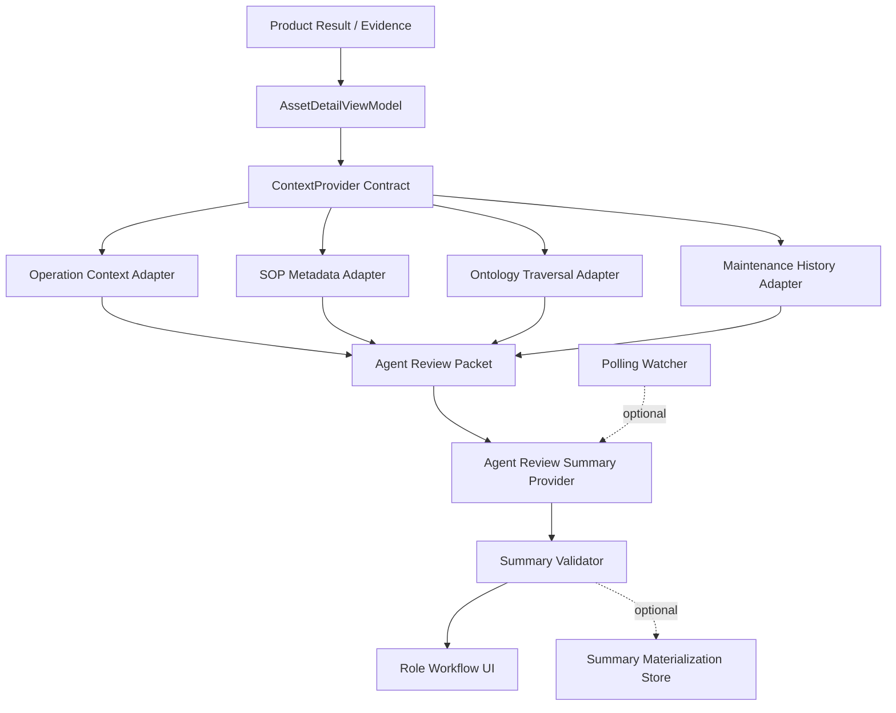

# AI Context Orchestration and Adapter Pipeline Plan

## Problem Frame

PR #130 and the follow-up AI summary slice establish a read-only Agent Review Packet and an LLM summary contract. The next question is not whether the LLM can write a paragraph. It can. The product question is whether the service can keep adding operating domains without making the AI path unstable.

This plan builds on `docs/plans/ai-workflow/2026-08-29-002-product-result-evidence-materialization-plan.md`. That materialization plan defines the trusted Product Result/Evidence boundary before UI, Report, Closed-loop, or AI consumers read prediction outputs. This orchestration plan starts after that boundary and focuses on how AI consumes trusted evidence with adapter-supplied context.

The target architecture is an evidence pipeline where domain adapters supply bounded, cited context; the packet normalizes that context; the LLM produces role-specific summaries; and the validator prevents Closed-loop authority leaks. This keeps the service extensible while preserving the existing ownership split:

```text
Product Result / Evidence
-> Domain Context Adapters
-> Agent Review Packet
-> AI Summary Contract
-> Human Workflow Surface
-> Closed-loop owner decision and mutation APIs
```

## Scope

This plan covers the next architecture slice for AI workflow, SOP/ontology exploration, watcher materialization, and evidence-based evaluation. It does not implement full automation or decide that LangGraph, GraphRAG, or vector RAG must be introduced now.

Current implementation baseline:

- `contracts/schemas/agent-review-packet.schema.json` defines the read-only packet.
- `contracts/schemas/agent-review-summary.schema.json` defines the LLM/deterministic output.
- `systems/backend/app/mvp/agent_review_packet.py` composes packet context from ViewModel and SOP retrieval.
- `systems/backend/app/mvp/agent_review_summary.py` composes deterministic fallback and validates summary output.
- `systems/backend/app/mvp/agent_review_summary_provider.py` wraps the LLM provider.
- `systems/frontend/src/features/mvp/overview/MvpWorkflowOverviewPage.tsx` consumes the summary inline.
- `tests/fixtures/agent_review_packets/` and summary tests provide the first gold traces.

## Requirements

- R1. The AI path must remain read-only. It may summarize, cite, and prepare review language, but must not create WorkOrder, MaintenanceAction, MaintenanceEvent, Replay, or auto approval state.
- R2. Domain context must enter the AI path through adapter-owned contracts, not hidden DB reads inside prompts.
- R3. Role summaries should stay focused on the two MVP roles currently represented in the product surface: `field_operator` and `process_manager`.
- R4. Missing context should be represented as `data_footnotes` or `evidence_gaps`, not as loud main-copy warnings that drown out usable evidence.
- R5. Polling watcher adoption must start at a lightweight materialization level before event/outbox promotion is added.
- R6. SOP RAG and GraphRAG must be treated as expansion paths because the current SOP source is a controlled, structured fixture.
- R7. KG/RDB comparison must control query intent, data scope, and expected answer shape; raw query syntax cannot be the controlled variable because graph and relational stores express traversal differently.
- R8. LLM validation must keep groundedness, boundary compliance, source refs, and role summary shape as release gates.

## Key Technical Decisions

- KTD-1. **Adapter pipeline first, orchestration framework later.** Introduce a `ContextProvider` style contract before LangGraph. LangGraph becomes useful when context gathering has multiple tool calls, retry branches, human pauses, or long-running state that is awkward in a service method.
- KTD-2. **Polling watcher starts as materialization, not promotion.** The first watcher should detect new Product Result artifacts and precompute `AgentReviewSummary` rows or files. It should not promote Closed-loop state or trigger approval logic.
- KTD-3. **Event/outbox promotion is deferred.** Outbox is warranted when state transitions must be durable, idempotent, retried, and audited across service boundaries. The current AI summary path is read-only and can tolerate request-time recompute or watcher retry.
- KTD-4. **Ontology remains the backbone.** Ontology should normalize relationships among asset, component, location, failure mode, factor, SOP procedure, and operating context. The LLM should consume these normalized relationships through packet fields, not discover them ad hoc.
- KTD-5. **KG Level 0 is a test footprint.** Do not add a production graph store yet. Add tests or evaluation traces that prove ontology traversal can answer multi-relationship questions better than flat packet fields when such questions appear.
- KTD-6. **RAG is not needed for structured demo SOP.** Current SOP is already structured, versioned, and maturity-gated. RAG becomes valuable when site SOPs arrive as unstructured PDFs, mixed versions, or cross-document procedure sets.
- KTD-7. **Role language is product contract.** Asset IDs, factor keys, and missing-data labels must be mapped into field/operator language before or during summary generation. Technical IDs can remain in `source_refs`.

## Architecture



The important boundary is that adapters gather domain facts, while the packet decides what the LLM is allowed to see. The LLM provider should not have its own domain query power until tool-call evaluation and authorization exist.

## Implementation Units

### U1. Context Provider Contract

- **Goal:** Define the stable abstraction that lets new domain adapters contribute context to the Agent Review Packet.
- **Files:**
  - `contracts/schemas/agent-review-packet.schema.json`
  - `systems/backend/app/mvp/agent_review_packet.py`
  - `systems/backend/app/mvp/context_providers.py`
  - `tests/test_agent_review_packet_golden.py`
- **Approach:** Create a small contract around context sections such as `operation_context_summary`, `sop_guidance`, `ontology_context`, `maintenance_history_summary`, and `data_footnotes`. Keep each section source-ref based and read-only.
- **Test Scenarios:**
  - A provider can add context without changing LLM summary schema.
  - A provider that has no evidence returns a typed gap instead of prose.
  - Duplicate source refs are deduplicated in packet output.
  - Provider output cannot add Closed-loop mutation fields.
- **Verification:** Golden packets still validate, and a new adapter fixture can be added with only schema/test updates for its section.

### U2. Domain Adapter Registry

- **Goal:** Make domain additions explicit and replaceable rather than hard-coded inside one packet composer.
- **Files:**
  - `systems/backend/app/mvp/context_providers.py`
  - `systems/backend/app/dependencies.py`
  - `tests/test_mvp.py`
- **Approach:** Register adapters from the composition root. Start with existing operation/SOP/location behavior as in-process adapters. Avoid plugin-like dynamic loading until there are external deploy-time adapters.
- **Test Scenarios:**
  - Default registry returns operation and SOP context for manufacturing demo.
  - Unknown adapter codes fail closed during service construction or packet generation.
  - Adapter exceptions are captured as evidence gaps rather than uncaught UI failures where reasonable.
- **Verification:** `agent_review_packet` behavior is unchanged for GS-002/GS-004/GS-007 except explicitly added context sections.

### U3. Polling Watcher Materialization

- **Goal:** Decide whether AI summaries should be prepared before the user opens the UI.
- **Files:**
  - `systems/backend/app/mvp/agent_review_summary.py`
  - `systems/backend/app/mvp/service.py`
  - `systems/backend/app/infra/db/migrations.py`
  - `tests/test_mvp.py`
  - `docs/plans/ai-workflow/2026-08-29-001-ai-context-orchestration-adapter-plan.md`
- **Approach:** Start with a Level 0 watcher contract: discover new or changed Product Result artifacts, compute packet checksum, compute summary, validate it, and store status. Do not mutate Closed-loop. Do not introduce event/outbox promotion in this unit.
- **Test Scenarios:**
  - Same artifact checksum is not summarized twice.
  - Provider failure records fallback status and validation errors.
  - New artifact checksum triggers a new summary materialization.
  - Materialized summary is read by UI when fresh; request-time generation remains fallback.
- **Verification:** Watcher can be run repeatedly without changing domain state and without duplicate summaries.

### U4. SOP / Ontology Exploration Adapter

- **Goal:** Add a controlled exploration path that combines SOP and ontology relationships before considering RAG or KG infrastructure.
- **Files:**
  - `systems/backend/app/mvp/sop_retrieval.py`
  - `systems/backend/app/ontology/ontology_service.py`
  - `systems/backend/app/mvp/context_providers.py`
  - `tests/test_agent_review_packet_golden.py`
  - `tests/test_agent_review_packet_eval_set.py`
- **Approach:** Implement ontology-backed lookup as an adapter behind packet composition. It should answer relationship questions such as component-to-location, factor-to-component, failure-mode-to-SOP, and SOP maturity gate.
- **Test Scenarios:**
  - GS-004 explains that three factor refs map to one `drive_power` inspection target.
  - A retired or draft SOP is not surfaced as user-facing guidance.
  - A missing SOP match produces a narrow gap or low-emphasis footnote, not an invented procedure.
  - Ontology lookup source refs are preserved in summary output.
- **Verification:** Existing packet/summary evals pass, and at least one test asserts ontology relationship traversal output.

### U5. KG Level 0 Comparison Trace

- **Goal:** Leave an evidence trail for whether KG is justified, without adding graph infrastructure prematurely.
- **Files:**
  - `tests/eval/agent_context_questions.jsonl`
  - `tests/eval/test_agent_context_retrieval_eval.py`
  - `docs/plans/ai-workflow/2026-08-29-001-ai-context-orchestration-adapter-plan.md`
- **Approach:** Define functional questions and expected answer facets. Compare the current normalized packet/RDB-style lookup against an ontology traversal adapter. Control variables by keeping the same question set, same fixture scope, same answer schema, and same pass/fail rubric.
- **Test Scenarios:**
  - Single-hop: asset -> component -> field location.
  - Two-hop: factor -> component -> SOP procedure.
  - Boundary: SOP exists but maturity gate blocks user guidance.
  - Missing context: no similar-event history returns a gap, not a fabricated count.
- **Verification:** The trace shows whether graph-style traversal improves correctness, explainability, or implementation simplicity enough to justify a real KG store later.

### U6. RAG Decision Gate

- **Goal:** Capture when RAG becomes worth implementing.
- **Files:**
  - `docs/plans/ai-workflow/2026-08-29-001-ai-context-orchestration-adapter-plan.md`
  - `tests/eval/agent_context_questions.jsonl`
- **Approach:** Keep RAG out of the runtime until there is unstructured SOP content or multi-document retrieval pressure. For now, represent RAG as an adapter-compatible future source.
- **Decision Gate:**
  - Site SOPs arrive as PDFs or free-form docs.
  - Multiple SOP versions overlap for the same component/failure mode.
  - Users need paragraph-level citations from procedures.
  - Structured metadata cannot answer expected SOP questions without manual expansion.
- **Verification:** The plan has explicit evidence needed before adding vector DB, LlamaIndex, GraphRAG, or LangGraph-based retrieval orchestration.

### U7. LangGraph Decision Gate

- **Goal:** Avoid adopting LangGraph before orchestration complexity actually exists.
- **Files:**
  - `systems/backend/app/mvp/agent_review_summary_provider.py`
  - `systems/backend/app/mvp/context_providers.py`
  - `tests/test_mvp.py`
- **Approach:** Keep current provider as a direct service call while the flow is packet -> LLM -> validator. Revisit LangGraph when the flow requires multiple stateful steps.
- **Decision Gate:**
  - The agent must call three or more independent domain tools.
  - The flow needs durable pause/resume for human review.
  - Retry strategy differs per step and must be observable.
  - Tool trajectory evaluation becomes part of release gates.
  - The service method starts carrying graph-like branching state.
- **Verification:** LangGraph remains a documented option, not a dependency hidden in MVP code.

## Data and Contract Shape

The stable AI-facing contract should stay close to this shape:

```text
AgentReviewPacket
  asset_id
  asset_label
  risk_summary
  inspection_targets
  sop_guidance
  operation_context_summary
  ontology_context
  maintenance_history_summary
  evidence_gaps
  source_refs
  closed_loop_boundary

AgentReviewSummary
  title
  summary
  role_summaries[field_operator, process_manager]
  inspection_focus
  data_footnotes
  source_refs
  boundary_note
  validation trace
```

New domains should add adapter output into packet sections, not new prompt-only context. If a field is not mature enough for user display, it should remain in source refs, trace, or footnotes.

## Polling Watcher Trade-Off

Polling watcher is useful when summaries need to be ready before UI interaction and when LLM latency should not be paid by the user. It also creates an audit trail for provider failures, fallbacks, and stale summaries.

The cost is additional state: checksum, freshness, retry policy, duplicate suppression, and materialization status. That is still much smaller than event/outbox promotion, which introduces durable delivery semantics and cross-service mutation responsibility.

Recommended sequence:

1. Request-time generation remains the canonical behavior.
2. Add materialization table or file only after the summary contract stabilizes.
3. Add polling watcher that writes validated summaries and status.
4. Add event/outbox only if other services must react durably to summary lifecycle events.

## RDB vs KG Test Framing

The comparison should not force the same SQL/graph query syntax. That would be a false control variable. The controlled variable should be the same user question, same fixture scope, same expected answer schema, and same acceptance rubric.

Example controlled question:

```text
For EVT-GS-004, explain why three top factors map to one field inspection target,
which location should be checked, and whether SOP guidance is available.
```

RDB-style lookup may answer this through joins or precomposed ViewModel fields. Ontology/KG traversal may answer it through factor -> component -> location -> SOP relationships. The fair comparison is whether the final grounded answer is correct, cited, maintainable, and cheaper to extend.

## Evaluation

Minimum release gates:

- Groundedness: no packet/source-ref unsupported fact.
- Boundary compliance: no Closed-loop mutation, approval, replay, or repair completion claim.
- Role shape: exactly `field_operator` and `process_manager` summaries for MVP workflow.
- Data gap handling: missing data appears as `evidence_gaps` or `data_footnotes`.
- Source refs: every nested summary source ref must exist in packet `source_refs`.

Useful but deferred metrics:

- Retrieval context precision/recall for SOP RAG.
- Tool trajectory accuracy for LangGraph-style agents.
- Human edit distance and accept-with-edit ratio.
- Summary freshness and stale materialization rate.
- Cost and latency per materialized summary.

## Scope Boundaries

Deferred:

- Production GraphRAG store.
- Vector DB or LlamaIndex runtime retrieval.
- LangGraph orchestration runtime.
- Event/outbox promotion for summary lifecycle.
- Auto approval of low-importance notifications.
- Closed-loop state mutation from AI summaries.

Outside this feature identity:

- Claiming real downtime reduction without MES and post-maintenance observations.
- Treating SOP fixture guidance as approved site SOP.
- Allowing LLM direct access to arbitrary domain databases.
- Replacing Product Result/Evidence computation with LLM reasoning.

## Sequencing

1. U1 Context Provider Contract.
2. U2 Domain Adapter Registry.
3. U4 SOP / Ontology Exploration Adapter.
4. U5 KG Level 0 Comparison Trace.
5. U3 Polling Watcher Materialization.
6. U6 RAG Decision Gate.
7. U7 LangGraph Decision Gate.

The reason U3 comes after the adapter and ontology work is simple: materializing summaries is only valuable once the context being materialized is stable. Otherwise the watcher just makes unstable payloads faster.

## Open Questions

- Should `ontology_context` be added to the packet as a first-class schema section, or should ontology remain a hidden implementation detail behind `inspection_targets` and `sop_guidance` for one more slice?
- Should materialized summaries be persisted in SQLite/PostgreSQL now, or should a file/checksum trace be enough for MVP review?
- Should role-specific copy be generated by LLM, deterministic templates, or a hybrid where LLM may only rewrite the quote text?
- What is the first non-SOP domain adapter after operation context: inventory, work schedule, MES production actuals, or maintenance history?
