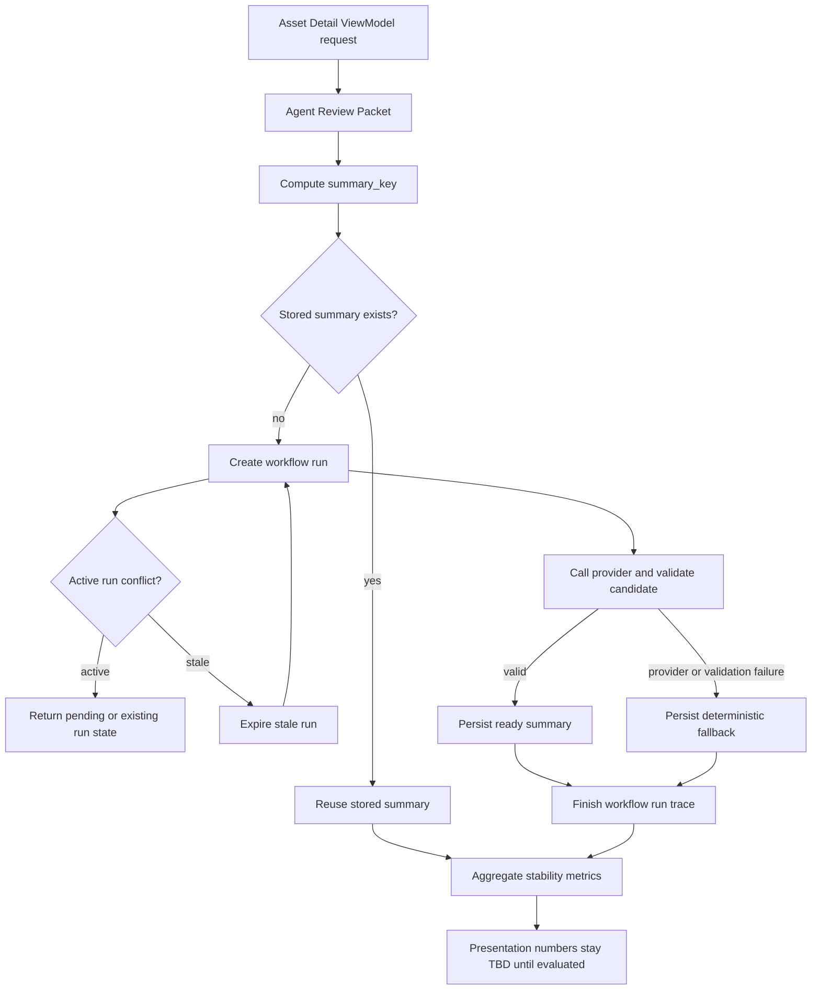

# Agent Workflow Stability Evaluation Plan

## Summary

이 계획은 Agent Review Summary workflow가 반복 실행, provider 실패, 검증 실패, stale running 상태에서
운영 판단 흐름을 깨뜨리지 않는지 검증하기 위한 안정성 전용 평가 계획이다. "안정성을 고려했다"는 설계
의도에 머물지 않고, 실패 격리, 저장본 재사용, 재시도 제한, stale recovery, DB run trace, side effect
차단을 테스트와 평가 지표로 확인하는 것이 목표다. AI 정확성, 재현성, XAI 시각화 평가는 별도 계획으로
분리한다.

---

## Problem Frame

발표에서 "AI workflow 안정성을 고려했다"는 말은 LLM 결과가 좋아 보였다는 뜻이 아니다. 검증이 없으면
안정성은 설계 의도에 그치므로, 같은 근거에서는 같은 저장 요약을 재사용하는지, 실패하면 조용히 누락되는
대신 fallback과 실패 사유가 남는지, 오래된 running 예약이 다음 생성을 막지 않는지, 조치 요청은 근거
불일치 시 side effect 없이 차단되는지를 시나리오별로 확인해야 한다.

이 계획은 운영 환경 안정성 검증 완료나 다운타임 절감 효과를 주장하지 않는다. 평가 전에는 수치를
`TBD`로 두고, 평가 실행 이후 retry/fallback/reuse/stale recovery/blocked side effect 지표를 채운다.

---

## Requirements

### Summary Reuse and Cache Stability

- R1. 같은 `summary_key` 입력에서는 새 LLM 호출보다 저장된 Agent Review Summary 재사용이 우선되어야 한다.
- R2. `summary_key`는 snapshot, prompt/schema version, model/provider context 같은 판단 근거 기준이 바뀌면 달라져야 한다.
- R3. cache hit은 단순 성능 최적화가 아니라 같은 근거에서 같은 요약을 재사용한다는 안정성 지표로 집계되어야 한다.

### Failure Containment

- R4. LLM provider disabled, timeout, invalid structured output은 deterministic fallback으로 수렴해야 한다.
- R5. fallback은 정상 요약처럼 위장되지 않고 `fallback_reason`, validation error, workflow status로 추적되어야 한다.
- R6. provider usage, token, latency, configured-rate cost가 측정되지 않으면 `0`으로 합성하지 않고 `not_measured` 또는 null-safe 상태로 남겨야 한다.

### Retry and Stale Recovery

- R7. active running workflow run은 같은 `summary_key`의 중복 생성을 막아야 한다.
- R8. stale running workflow run은 lease 만료 또는 recovery 정책으로 failed 처리되어 후속 생성을 막지 않아야 한다.
- R9. retry는 무한 반복하지 않고 bounded attempt와 terminal state를 남겨야 한다.

### Side Effect Safety

- R10. Agent Review Summary 조회, 생성, fallback은 Recommendation, WorkOrder, MaintenanceAction 같은 mutation을 직접 만들지 않아야 한다.
- R11. 사용자가 본 snapshot과 서버 projection이 다르면 조치 요청은 side effect 없이 거부되어야 한다.
- R12. 안정성 평가 결과는 발표 자료에 들어갈 수 있도록 분모/분자와 실패 사유가 분리된 aggregate report로 남아야 한다.

### Verification Evidence

- R13. 안정성 주장은 단위/계약 테스트, 반복 평가, DB trace 확인 중 하나 이상의 검증 산출물과 연결되어야 한다.
- R14. 발표 자료에는 평가 전 `TBD` 수치와 평가 후 실제 수치를 구분해 표시해야 한다.
- R15. "안정성을 중점으로 설계했다"는 표현은 반드시 검증 항목과 측정 지표를 함께 제시할 때만 사용한다.

---

## Key Technical Decisions

- KTD1. **Reuse is a first-class stability metric:** 저장본 재사용률은 latency 최적화가 아니라 같은 근거에서 같은 설명이 반복 노출되는지 확인하는 지표로 본다.
- KTD2. **Fallback is contained success:** provider 실패나 validation 실패는 숨겨진 장애가 아니라 deterministic fallback과 trace가 남은 containment 성공으로 분류한다.
- KTD3. **Workflow runs and summaries stay separate:** 생성 시도 이력은 `agent_review_workflow_runs`, 최종 조회 산출물은 `agent_review_summaries`로 분리해 성공, 실패, fallback, stale recovery를 모두 추적한다.
- KTD4. **No silent numeric synthesis:** cost, token, latency가 측정되지 않았을 때 0으로 채우면 안정성 지표가 왜곡되므로 `not_measured`를 명시한다.
- KTD5. **Read-only AI boundary:** 안정성 검증은 AI 요약이 조치 명령을 직접 만들지 않는다는 경계까지 포함하되, 조치 추천 품질 평가는 이 계획의 범위에서 제외한다.
- KTD6. **Bounded retry before broad resilience patterns:** 발표와 평가 범위에서는 bounded retry, idempotent read/reuse, stale recovery를 먼저 검증하고, circuit breaker나 chaos engineering은 운영 부하가 확인된 뒤 follow-up으로 둔다.
- KTD7. **Design claims need verification artifacts:** 안정성 설계 주장은 테스트 결과, 평가 row, aggregate report, DB run trace 같은 검증 산출물과 묶어야 발표에서 과장 없이 말할 수 있다.

---

## High-Level Technical Design



---

## Scope Boundaries

### In Scope

- Agent Review Summary 저장본 재사용 검증
- LLM provider failure와 invalid output fallback 검증
- workflow run state, retry, stale recovery 검증
- 안정성 지표 aggregate report 설계
- AI 요약이 mutation을 직접 만들지 않는 read-only 경계 확인

### Deferred to Follow-Up Work

- LLM 내용 정확성, groundedness, acceptance rate 전체 평가는 `docs/plans/ai-workflow/2026-09-01-001-feat-agent-summary-120-run-eval-plan.md`에서 다룬다.
- 재현성, 시간 정합성, XAI 검증은 `docs/plans/ai-workflow/2026-09-01-003-feat-ai-workflow-stability-reproducibility-evaluation-plan.md`와 XAI 확장 계획에서 다룬다.
- 실제 SHAP, Shapelet, Counterfactual 구현은 안정성 평가 범위가 아니다.
- circuit breaker, jittered exponential backoff, chaos/fault-injection suite, OpenTelemetry instrumentation 도입은 현재 안정성 평가를 통과한 뒤 운영 요구가 커질 때 별도 계획으로 다룬다.

### Out of Scope

- 운영 환경 다운타임 감소 주장
- 현장 비용 절감 수치 산출
- WorkOrder 추천 품질 평가
- UI side-view 그래프 구현

---

## Stability Verification Strategy

안정성 검증은 세 단계로 나눈다. 첫째, 단위/계약 테스트로 fallback, retry 제한, stale running 만료,
snapshot mismatch 차단이 기대대로 동작하는지 확인한다. 둘째, 반복 평가로 8개 gold fixture와 반복 실행을
통해 reuse rate, fallback rate, failed terminal count, latency 같은 지표를 집계한다. 셋째, 운영 추적
검증으로 `summary_key`, `workflow_run_id`, `workflow_status`, `fallback_reason`이 DB trace와 aggregate
report에 남는지 확인한다.

이 전략은 "장애가 없다"를 증명하려는 것이 아니라, 장애와 불일치가 발생했을 때 시스템이 어디서 멈추고
어떤 상태를 남기며 잘못된 조치로 번지지 않게 막는지를 검증한다. 따라서 안정성 발표 문장은 항상
`설계 목표 -> 실패 시나리오 -> 검증 산출물 -> 아직 TBD인 수치` 순서로 말한다.

| Stability claim | Verification artifact | Metric to fill |
|---|---|---|
| 같은 근거에서는 저장 요약을 재사용한다 | `summary_key` reuse test, evaluation row | Stored summary reuse rate |
| LLM/provider 실패는 fallback으로 격리된다 | provider disabled / invalid output test | Fallback count / rate |
| 재시도는 무한 반복하지 않는다 | watcher bounded attempt test | Bounded retry exhausted count |
| stale running은 후속 생성을 막지 않는다 | stale lease expiration test, DB run trace | Stale running recovered count |
| 근거 불일치는 조치 side effect로 번지지 않는다 | snapshot mismatch test | Snapshot mismatch side effects blocked |
| 실패와 fallback은 추적 가능한 상태로 남는다 | workflow run trace, aggregate report | Failed terminal count, fallback reason count |

---

## Implementation Units

### U1. Define Stability Evaluation Rows

**Goal:** 안정성 평가 결과를 발표 자료와 PR 검토에서 재사용할 수 있는 row/aggregate 형태로 고정한다.

**Requirements:** R3, R6, R12, R13, R14

**Dependencies:** None

**Files:**

- `tests/eval/agent_workflow_eval_gate.json`
- `tests/eval/results/`
- `docs/plans/ai-workflow/2026-09-01-001-feat-agent-summary-120-run-eval-plan.md`

**Approach:** case id, iteration, provider mode, summary key, run status, reused 여부, fallback 여부, retry count, stale recovery 여부, validation error, latency/token/cost 측정 상태를 한 row로 남긴다. aggregate report는 total attempts, reused, fallback, failed, stale recovered, blocked side effect를 분리 집계한다.

**Patterns to follow:**

- `tests/eval/results/agent_summary_llm_observability_eval_2026-09-01.json`
- `docs/contributions/hb-ai-review-evidence.md`

**Test scenarios:**

- 동일한 평가 입력 120건이 mode와 status를 포함한 row로 집계된다.
- token/cost/latency가 없을 때 0이 아니라 `not_measured`로 남는다.
- fallback count와 failed count가 같은 칸에 섞이지 않는다.
- stored summary reuse count가 accepted LLM candidate count와 분리된다.
- 평가 전 수치는 `TBD`, 평가 후 수치는 실제 measured value로 구분된다.

**Verification:** 평가 결과 JSON과 발표용 요약 표가 같은 분모를 사용하고, 측정 불가 값이 숫자 0으로 합성되지 않는다.

### U2. Verify Stored Summary Reuse

**Goal:** 같은 근거에서 Agent Review Summary가 재생성되지 않고 저장본을 재사용하는지 검증한다.

**Requirements:** R1, R2, R3, R13

**Dependencies:** U1

**Files:**

- `systems/backend/app/mvp/agent_review_summary_materialization.py`
- `systems/backend/app/mvp/service.py`
- `systems/backend/app/infra/db/mvp_audit_repository.py`
- `tests/test_mvp.py`
- `tests/test_agent_review_summary_contract.py`

**Approach:** `summary_key` 계산 기준을 평가 입력에 포함하고, 같은 packet/context에서는 stored summary가 반환되는지 확인한다. snapshot 또는 model/provider context가 달라지는 경우에는 reuse가 아니라 새 materialization 후보로 분류한다.

**Patterns to follow:**

- `systems/backend/app/mvp/service.py`의 `_agent_review_summary_lock`와 workflow run trace 구성
- `systems/backend/app/infra/db/mvp_audit_repository.py`의 `get_agent_review_summary` / `store_agent_review_summary`

**Test scenarios:**

- 같은 packet과 같은 provider context로 두 번 조회하면 두 번째 결과는 stored summary를 재사용한다.
- snapshot basis가 달라지면 이전 summary key를 재사용하지 않는다.
- forced regeneration 정책이 있는 경우 일반 조회와 강제 재생성이 aggregate에서 구분된다.
- concurrent lookup 상황에서 같은 summary key에 대해 중복 running run이 생성되지 않는다.

**Verification:** run trace 또는 평가 row에 `reused`, `created`, `running_conflict`가 구분되어 남는다.

### U3. Verify Provider Failure and Fallback Containment

**Goal:** provider 장애와 invalid output이 사용자 판단 흐름을 깨지 않고 deterministic fallback으로 수렴하는지 검증한다.

**Requirements:** R4, R5, R6, R13

**Dependencies:** U1

**Files:**

- `systems/backend/app/infra/llm/provider.py`
- `systems/backend/app/mvp/agent_review_summary_provider.py`
- `systems/backend/app/mvp/agent_review_summary_materialization.py`
- `tests/test_agent_review_summary_contract.py`
- `tests/test_mvp.py`

**Approach:** provider disabled, timeout-like failure, malformed structured output, forbidden claim violation을 서로 다른 failure reason으로 평가한다. fallback summary는 source refs와 limitation을 유지하고, ready LLM summary와 같은 성능 주장으로 집계하지 않는다.

**Patterns to follow:**

- `docs/contributions/hb-ai-review-evidence.md`의 fallback 저장 경계
- `systems/backend/app/mvp/agent_review_summary_provider.py`의 provider candidate validation 흐름

**Test scenarios:**

- provider disabled 상태에서는 deterministic fallback이 저장되고 `fallback_reason`이 남는다.
- invalid candidate는 ready summary로 저장되지 않고 fallback 또는 failed terminal state로 끝난다.
- provider usage가 없는 fallback row는 token/cost를 0으로 합성하지 않는다.
- fallback summary는 Recommendation Input이나 WorkOrder 생성으로 이어지지 않는다.

**Verification:** fallback 결과가 UI/API에서 조회 가능하되, aggregate report에서는 accepted LLM candidate와 별도로 집계된다.

### U4. Verify Retry, Running Conflict, and Stale Recovery

**Goal:** workflow run이 active duplicate를 막고 stale reservation은 회복하는지 검증한다.

**Requirements:** R7, R8, R9, R13

**Dependencies:** U1, U2

**Files:**

- `systems/backend/app/mvp/agent_review_summary_workflow.py`
- `systems/backend/app/mvp/service.py`
- `systems/backend/app/infra/db/mvp_audit_repository.py`
- `scripts/watch_agent_review_summaries.py`
- `tests/test_agent_review_summary_watcher_cli.py`
- `tests/test_mvp.py`

**Approach:** running unique constraint, stale lease expiration, bounded watcher attempt를 분리해 검증한다. 오래된 running run은 failed/stale recovery 상태로 전환하고, active run은 중복 생성을 막는 정상 상태로 본다.

**Patterns to follow:**

- `mvp_audit_repository.py`의 `expire_stale_agent_review_workflow_run`
- `service.py`의 `_is_agent_review_running_conflict`
- watcher CLI의 once/watch mode와 bounded retry 계약

**Test scenarios:**

- active running run이 있으면 같은 summary key로 새 workflow run이 생성되지 않는다.
- stale running run은 lease 기준으로 expired 처리되고 후속 생성이 가능하다.
- watcher retry는 최대 시도 횟수 이후 terminal state를 남긴다.
- stale recovery와 provider fallback이 동시에 발생해도 상태가 하나의 모호한 failure로 뭉개지지 않는다.

**Verification:** workflow run 목록에서 `running`, `completed`, `fallback`, `failed`, `stale_running_lease_expired`가 구분되어 조회된다.

### U5. Verify Read-Only Boundary and Side Effect Blocking

**Goal:** 안정성 평가가 AI 요약 read-only 경계와 mutation 차단까지 확인하도록 만든다.

**Requirements:** R10, R11, R13

**Dependencies:** U1

**Files:**

- `contracts/schemas/recommendation-input.schema.json`
- `systems/backend/app/maintenance/api_schema.py`
- `systems/backend/app/maintenance/service.py`
- `tests/test_maintenance_loop_application.py`

**Approach:** Agent Review Summary 생성/조회/fallback이 조치 command를 직접 만들지 않는지 확인한다. 사용자가 본 snapshot basis와 서버의 current projection이 다르면 inspection request가 WorkOrder 없이 거부되는지 side effect count로 검증한다.

**Patterns to follow:**

- `docs/plans/ai-workflow/2026-08-29-003-evidence-snapshot-consistency-guard-plan.md`
- `docs/contributions/hb-ai-review-evidence.md`의 Closed-loop snapshot guard 설명

**Test scenarios:**

- Agent Review Summary text만으로 Recommendation Input이 생성되지 않는다.
- snapshot basis가 누락된 request는 validation error로 끝난다.
- client snapshot과 server projection artifact id가 다르면 WorkOrder가 생성되지 않는다.
- fallback summary가 존재해도 조치 요청은 Product Result / Evidence lineage 검증을 통과해야 한다.

**Verification:** mismatch 거부 시 persisted command record와 WorkOrder count가 증가하지 않는다.

---

## Baseline Comparison: Direct LLM vs Evidence Packet vs Current Workflow

### 목적과 현재 검증 상태

현재 workflow의 복잡성이 실제 가치를 만드는지 확인하기 위해 동일 사례를 세 경로로 비교한다. 발표의
주 비교는 **LLM only(B1)와 전체 pipeline 적용 후(B3)**이며, B2는 차이가 Evidence Packet 때문인지
운영 계층 때문인지 설명하는 보조 진단군이다. LLM 응답 품질과 운영 장애 복구를 하나의 점수로 합치지 않는다. 현재 상태는 **planned / unverified**이며,
실제 반복 LLM 호출 결과나 우열 수치는 아직 없다. 계약 fixture와 contract test는 평가 구조만 검증한다.

| Arm | 입력과 사용 계층 | 의도적으로 제외하는 계층 | 비교 목적 |
|---|---|---|---|
| B1 Direct LLM | 원본 입력을 최소 정리하여 동일 read-only 출력 계약으로 호출 | Evidence Packet, orchestration, reuse, retry, fallback, DB trace | 파이프라인 없는 기준선 |
| B2 Evidence Packet + LLM | 현재 시스템의 Evidence Packet과 동일 출력 계약 | orchestration, reuse, retry, fallback, DB trace | 데이터 구조화와 근거 패키징의 단독 효과 |
| B3 Current Workflow | Evidence Packet, validation, reuse, bounded retry, deterministic fallback, DB trace, stale recovery, snapshot/side-effect guard | 없음 | 전체 운영 경로의 효과 |

Direct LLM에는 완성된 Evidence Packet을 제공하지 않는다. B1에 packet을 제공하면 B2와의 차이가 사라져
구조화 계층의 기여를 측정할 수 없다.

### 공정한 비교와 실행 설계

- 동일 사례, provider/model, temperature/generation 설정, 출력 schema, rubric, read-only 권한을 사용한다.
- 기존 `GS-001~GS-008` 8개 사례를 사용하고 arm별 사례당 3회 반복해 총 72회 실행한다.
- 실행 순서는 arm과 사례 순서를 섞고, 실제 순서를 evaluation row에 기록한다.
- B1/B2/B3 모두 WorkOrder와 MaintenanceAction 생성 권한을 갖지 않는다.
- 측정하지 못한 적용 가능 값은 `value=null, state=not_measured`로 기록한다.
- 해당 arm에 기능 자체가 없으면 `value=null, state=not_applicable`로 기록하며 실패율 분모에 넣지 않는다.
- 자동 평가와 사람 검토의 rubric/version을 고정하고, 변경 시 동일 실험으로 집계하지 않는다.

### Evaluation Row 및 Aggregate Contract

공통 계약은
`tests/eval/agent_workflow_baseline_comparison_contract.json`에 정의한다. row에는 최소한
`case_id`, `iteration`, `arm`, `execution_order`, provider/model/generation config,
output schema/rubric version, execution status, metrics를 남긴다.

| 상태 | 의미 | 값 규칙 |
|---|---|---|
| measured | 실행으로 신뢰 가능한 값을 관측함 | 실제 값 |
| not_measured | 지표는 적용되지만 측정하지 못함 | `null` + 사유 |
| not_applicable | 해당 arm에는 기능/지표가 존재하지 않음 | `null` + 사유 |
| planned | 실행 설계만 존재함 | 결과로 집계하지 않음 |
| unverified | fixture/contract만 있고 live 반복 근거가 없음 | 성능 주장 금지 |

Aggregate는 arm과 case category별로 품질, 반복 일관성, 효율성, 운영 통제, 장애 주입을 별도 section으로
보고한다. 숫자 집계는 measured 값만 분모에 포함하고 상태별 row 수도 함께 제시한다.

| Metric group | Metrics |
|---|---|
| 응답 품질 | schema 통과율, unsupported claim rate, 핵심 근거 누락률, 반복 핵심 판단 일치율 |
| 운영 통제 | fallback, retry 횟수, saved-summary reuse, workflow trace 완전성 |
| 비용 | input/output token, 실행당 추정 비용, valid output당 추정 비용 |

비용은 provider가 반환한 token usage와 version이 명시된 설정 단가로 계산한다. usage 또는 단가가 없으면
0원으로 만들지 않고 `null + not_measured`로 남긴다. latency, 세부 필드 변동, evidence reference 일치율, stale recovery 비율과 비정상 running row 비율은 이번 72-run의 필수 지표에서 제외한다. 이미 계약 테스트가 있는 동시 요청, stale running, DB trace 저장 실패도 live 장애 실험으로 중복 구현하지 않는다.

자동 평가는 schema/필수 필드/source-ref membership, retry/reuse/fallback, trace 완전성을 담당한다.
사람은 사례·arm별 최종 출력 1개만 검토해 unsupported claim의 심각도, 핵심 근거 누락, 핵심 판단
일관성을 확인한다. 오류가 발견된 사례만 추가 표본을 검토한다.

### 계층별 기여도와 결과 해석

비교표에는 B1, B2, B3 원값과 `B2-B1`, `B3-B2`, `B3-B1`을 함께 두되, 최종 판단은
`B3-B1`(LLM only 대비 전체 pipeline 효과)을 우선한다.

- B2 - B1: Evidence Packet과 데이터 구조화의 기여
- B3 - B2: validation, orchestration, reuse, fallback, trace의 기여
- B3 - B1: 전체 파이프라인의 종합 효과
- B1과 B3의 품질 차이가 작으면 현재 복잡성이 과도할 가능성을 검토한다.
- 품질은 비슷하지만 B3만 재현성·추적성·실패 격리를 제공하면 운영 통제를 핵심 가치로 해석한다.
- B2와 B3가 거의 같으면 Evidence + validation 중심으로 단순화할 가능성을 검토한다.
- B3가 품질·일관성·실패 격리를 모두 개선하면 전체 workflow 복잡성을 유지할 근거가 된다.

### 운영 시뮬레이션 적용 범위

| Scenario | B1 | B2 | B3 | 보고 축 |
|---|---:|---:|---:|---|
| GS-001~008 반복 품질 평가 | 적용 | 적용 | 적용 | 품질·일관성 |
| provider timeout | 선택적 기준선 | 선택적 기준선 | retry/fallback | 장애 복구 |
| malformed output | schema 결과 관측 | schema 결과 관측 | validation/fallback containment | 장애 복구 |
| snapshot mismatch | read-only 계약 확인 | read-only 계약 확인 | side-effect 차단 | 안전 경계 |
| 429 / transient 5xx | 미실행 | 미실행 | 기존 contract test 또는 후속 | 후속 |
| 동일 summary_key 동시 요청 | N/A | N/A | 기존 contract test | 중복 run 차단 |
| stale running / DB trace 저장 실패 | N/A | N/A | 기존 contract test 또는 후속 | 후속 |

실제 장애 주입은 malformed output, provider timeout, snapshot mismatch 3종만 수행한다. Direct LLM이나
B2에 reuse가 없는 것은 실패가 아니라 `not_applicable`이다. 나머지는 기존 contract test 증거를
재사용하거나 후속으로 둔다. LLM 품질 점수와 장애 복구/격리 점수는 합산하지 않는다.

### 실행 결과 비교표 형식

| Metric | B1 | B2 | B3 | B2-B1 | B3-B2 | B3-B1 | Status / denominator |
|---|---:|---:|---:|---:|---:|---:|---|
| Grounded claim rate | TBD | TBD | TBD | TBD | TBD | TBD | planned |
| Schema validation pass rate | TBD | TBD | TBD | TBD | TBD | TBD | planned |
| Core judgment agreement | TBD | TBD | TBD | TBD | TBD | TBD | planned |
| Core judgment agreement | TBD | TBD | TBD | TBD | TBD | TBD | planned |
| Fallback / retry | N/A | N/A | TBD | N/A | TBD | TBD | planned |
| Summary reuse / trace completeness | N/A | N/A | TBD | N/A | TBD | TBD | planned |
| Estimated cost / valid output | TBD | TBD | TBD | TBD | TBD | TBD | planned or not_measured |

### 발표용 결론 문구

평가 전에는 다음처럼 말한다.

```text
전체 Agent Workflow가 당연히 더 낫다고 가정하지 않고, Direct LLM, Evidence Packet + LLM,
현재 Workflow를 같은 조건에서 비교하도록 평가 계약을 먼저 고정했습니다. 아직 실제 반복 호출은
실행하지 않았으므로 현재 확인된 것은 비교 구조와 실패 시나리오이며, 성능 우위는 미검증 상태입니다.
```

평가 후에는 측정 결과에 맞춰 다음 중 하나를 선택한다.

- Evidence Packet 기여가 크면: “근거 패키징이 품질 개선의 주된 원인이었습니다.”
- 품질 차이는 작고 B3 통제가 크면: “전체 workflow의 핵심 가치는 품질 상승보다 재현성·추적성·실패 격리였습니다.”
- B2와 B3가 같으면: “복잡한 orchestration을 줄이고 Evidence + validation 계층으로 단순화할 근거를 얻었습니다.”
- B3가 전 축에서 개선되면: “품질·일관성·실패 격리 개선이 전체 workflow 복잡성을 정당화했습니다.”

---

## Metrics to Fill After Evaluation

| Metric | Value |
|---|---|
| Total stability attempts | TBD |
| Stored summary reuse count | TBD |
| Stored summary reuse rate | TBD |
| New workflow run count | TBD |
| Active running conflict count | TBD |
| Stale running recovered count | TBD |
| Fallback count | TBD |
| Fallback rate | TBD |
| Provider-disabled fallback count | TBD |
| Invalid-output fallback count | TBD |
| Failed terminal count | TBD |
| Bounded retry exhausted count | TBD |
| Snapshot mismatch side effects blocked | TBD |
| p50 lookup/materialization latency | TBD |
| p95 lookup/materialization latency | TBD |
| Token/cost not-measured rows | TBD |

---

## Acceptance Examples

- AE1. Given a stored summary exists for the same `summary_key`, when the side view requests Agent Review Summary again, then the stored summary is reused and the evaluation row records `reused=true`.
- AE2. Given the LLM provider is disabled, when summary materialization is requested, then deterministic fallback is persisted with `fallback_reason` and no token/cost value is synthesized.
- AE3. Given an active workflow run already exists for a summary key, when another request arrives, then no duplicate running run is created.
- AE4. Given a running workflow run is older than the stale lease threshold, when materialization is requested again, then the stale run is expired and a new run can proceed.
- AE5. Given the client snapshot basis does not match the server projection, when an inspection request is submitted, then no WorkOrder or command side effect is persisted.

---

## Risks and Dependencies

| Risk | Mitigation |
|---|---|
| 안정성 수치와 AI 정확성 수치가 섞일 수 있음 | reuse/fallback/retry/stale recovery 지표와 LLM acceptance/groundedness 지표를 별도 report section으로 분리한다. |
| fallback을 성공 요약처럼 발표할 수 있음 | fallback은 containment 성공으로만 표현하고 accepted LLM candidate에 포함하지 않는다. |
| latency/cost 미측정값이 0으로 보일 수 있음 | `not_measured` 상태를 schema와 aggregate에 명시한다. |
| stale recovery를 active duplicate 허용으로 오해할 수 있음 | active conflict와 stale expiration test를 별도 scenario로 둔다. |
| snapshot guard가 AI workflow 안정성 밖으로 밀릴 수 있음 | side effect 차단은 read-only AI boundary의 안정성 검증으로 포함하되 추천 품질 평가는 제외한다. |
| 외부 안정성 패턴을 한 번에 모두 넣어 범위가 커질 수 있음 | retry/idempotency/trace/fallback만 현재 검증 대상으로 두고, circuit breaker와 chaos engineering은 follow-up으로 제한한다. |

---

## External Reference Fit Review

외부 레퍼런스 기준으로 보면 현재 계획은 안정성 평가의 최소 핵심은 충분히 포함한다. Azure Retry pattern과
Azure Well-Architected transient fault guidance는 bounded retry, retry 적합성 판단, 무한 retry 금지,
retry failure logging을 강조한다. 이 계획의 bounded retry, terminal state, failure reason 집계는 그
방향과 맞다. 다만 exponential backoff나 jitter 값까지 지금 정하면 평가 계획이 구현 정책으로 과해지므로
follow-up으로 둔다.

AWS Well-Architected와 AWS Durable Execution guidance는 retry 가능한 작업에는 idempotency가 필요하고,
side effect가 있는 단계는 중복 실행을 막아야 한다고 본다. 이 계획의 `summary_key` 저장본 재사용,
active running conflict, snapshot mismatch side effect 차단은 이 기준과 맞다. 현재 프로젝트는 durable
workflow 플랫폼을 도입한 상태가 아니므로 Temporal/AWS Durable Execution 수준의 full durable execution
요구를 넣지는 않는다.

OpenTelemetry와 Azure mission-critical guidance는 logs, metrics, traces, correlation ID 같은 관측성을
강조한다. 이 계획의 DB workflow run trace와 aggregate report는 발표/평가 단계에는 충분하지만, 전사
관측성 도구 도입까지 요구하면 과하다. 운영 단계로 확장할 때만 OpenTelemetry-style instrumentation을
별도 계획으로 검토한다.

NIST AI RMF와 OpenAI Structured Outputs 관점에서는 AI 결과를 schema/validator/fallback으로 제한하는
방향이 타당하다. 하지만 이 문서는 AI 품질 평가가 아니라 workflow 안정성 평가이므로 groundedness나 모델
정확성 수치를 이 계획 안에 합치지 않는다.

정리하면 현재 계획의 범위는 발표용으로 과하지 않다. 보강할 만한 항목은 `idempotent read/reuse`,
`bounded retry`, `terminal state`, `not_measured`, `side effect blocked` 정도이며, chaos engineering,
circuit breaker, full OpenTelemetry, durable workflow framework 도입은 이번 계획에 넣지 않는 것이 맞다.

---

## Presentation Claim Boundary

평가 전 발표에서는 다음처럼 말한다.

```text
안정성을 단순한 설계 원칙으로만 두지 않고, 실패 시나리오별 검증 항목으로 쪼갰습니다.
LLM/provider 실패 시 fallback으로 수렴하는지, 같은 근거에서는 저장본을 재사용하는지,
오래된 running 상태가 다음 생성을 막지 않는지, 근거 불일치가 WorkOrder 생성으로 번지지 않는지를
테스트와 반복 평가 지표로 확인할 계획입니다.
```

평가 실행 후에는 다음 수치를 함께 말한다.

```text
평가 실행 후에는 reuse rate, fallback rate, stale recovery count, failed terminal count,
snapshot mismatch blocked count, p95 materialization latency를 채워 안정성 주장의 근거로 사용합니다.
```

평가 수치 없이 피할 표현:

- "운영 환경에서 안정성이 검증됐다"
- "장애가 발생해도 항상 정상 동작한다"
- "다운타임을 줄였다"
- "AI 정확도가 높다"
- "fallback도 LLM 성공 결과와 동일하게 볼 수 있다"

---

## Sources and Research

- `docs/plans/ai-workflow/2026-09-01-003-feat-ai-workflow-stability-reproducibility-evaluation-plan.md`
- `docs/plans/ai-workflow/2026-09-01-001-feat-agent-summary-120-run-eval-plan.md`
- `docs/plans/ai-workflow/2026-08-29-003-evidence-snapshot-consistency-guard-plan.md`
- `docs/contributions/hb-ai-review-evidence.md`
- `systems/backend/app/mvp/agent_review_summary_materialization.py`
- `systems/backend/app/mvp/agent_review_summary_workflow.py`
- `systems/backend/app/mvp/service.py`
- `systems/backend/app/infra/db/mvp_audit_repository.py`
- `tests/test_mvp.py`
- `tests/test_agent_review_summary_contract.py`
- `tests/test_agent_review_summary_watcher_cli.py`
- `tests/test_maintenance_loop_application.py`
- Azure Architecture Center, Retry pattern
- Azure Well-Architected Framework, Recommendations for handling transient faults
- AWS Well-Architected Framework, REL04-BP04 Make all responses idempotent
- AWS Durable Execution SDK Developer Guide, Idempotency and retries
- OpenTelemetry documentation, Observability primer
- NIST AI Risk Management Framework
- OpenAI, Structured Outputs in the API
