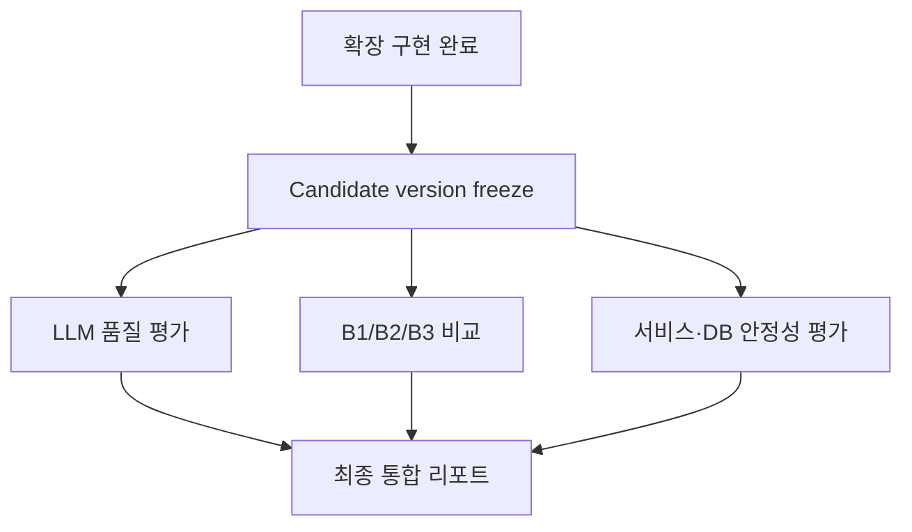

# Agent Workflow Final Evaluation Plan

## Summary

이 문서는 Agent Review Summary와 현재 Agent Workflow의 최종 평가 순서와 산출물을 고정한다.
LLM 출력 품질, Evidence Packet의 기여, 전체 Workflow의 운영 통제, 장애 격리와 DB 추적을 하나의
점수로 섞지 않고 서로 다른 실행기로 검증한 뒤 하나의 최종 리포트에서 함께 판정한다.

**최종 평가는 `2026-09-02-002-operational-domain-extension-plan.md`의 도메인·워크플로 확장 구현과
completion gate가 끝난 뒤 수행한다.** 확장 전 실행은 하네스 smoke, 계약 검증, 회귀 탐지에만 사용하며
최종 품질·안정성 수치로 발표하거나 문서화하지 않는다.
확장 구현 이후 평가 대상의 prompt/schema, provider/model, context tool, persistence/retry 정책을
고정하고 같은 candidate version을 대상으로 전체 평가를 다시 실행한다.

## Decision

### 실행기와 리포트의 분리

평가 실행기는 평가 축별로 분리한다.

1. LLM 품질 실행기
2. B1/B2/B3 계층 비교 실행기
3. 실제 서비스·DB 기반 Workflow 안정성 실행기

세 실행기의 row를 하나의 만능 스키마로 강제하거나 품질과 안정성을 합산하지 않는다. 공통 run
metadata와 measurement 표현만 공유하고, 최종 리포트가 각 평가 artifact를 참조해 별도 gate로
판정한다.

최종 리포트는 `quality_gate`, `workflow_value_gate`, `reliability_gate`,
`safety_gate`를 독립적으로 표시한다. `overall_release_decision`은 필수 gate의 AND 결과다.
품질 점수와 안정성 점수를 더한 단일 종합점수는 사용하지 않는다. fallback은 LLM 품질 성공이 아니라
장애 격리 성공으로만 집계한다.

### 안정성의 주장 범위

이 계획에서 안정성은 운영 uptime이나 실제 비용 절감이 아니라, 예측 결과가 조직 판단으로 전달되는
흐름의 구조적 안정성을 뜻한다. 최종 리포트는 다음 네 축을 분리해 판정한다.

| 안정성 축 | 확인하려는 질문 | 대표 측정 |
|---|---|---|
| 시간 정합성 | UI, AI brief, handoff가 같은 Evidence Snapshot과 context version/as-of를 보는가? | temporal validation pass, stale/snapshot mismatch 차단 |
| 책임분리 | AI/Agent가 설명과 brief를 넘어 recommendation, WorkOrder, command mutation을 만들지 않는가? | mutation attempt count, generated recommendation count, side-effect delta |
| 확장성 | 생산/WIP, 정비창, 부품/기술자, 품질/납기 context가 붙어도 같은 read-only port/resolver/brief 구조가 유지되는가? | scenario coverage, relation source/version/as-of completeness, gap/conflict handling |
| 장애 격리 | LLM/provider, 외부 context API, schema 검증 실패가 정상 판단처럼 보이지 않고 fallback/gap/failed 상태로 격리되는가? | fallback isolation, fallback reason coverage, retry exhausted, invalid candidate not persisted, external API fallback 처리 |

확장 구현 candidate의 deterministic synthetic smoke에서 관측한 `temporal validation 3/3`,
`mutation attempts 0`, `generated recommendations 0`, `3 scenarios`, `154 passed, 0 failed`는
최종 운영 안정성 수치가 아니라 최종 평가 전 구조적 smoke evidence로만 둔다. 최종 안정성 수치는
frozen candidate에 대해 Runner 3과 Phase 4를 다시 실행한 결과만 사용한다.

## Current Evidence State

| 평가 축 | 현재 산출물 | 현재 상태 | 최종 주장 가능 여부 |
|---|---|---|---|
| LLM 품질 | 8개 gold fixture, 120-run harness, live 결과와 리포트 | Verified | 해당 실행 당시 candidate에 한해 가능 |
| B1/B2/B3 비교 | 72-row mock simulation, 3종 fault simulation | Partially Verified | 비교 구조와 mock 동작만 가능 |
| Workflow 안정성 | row/aggregate contract와 contract fixture | Partially Verified | 운영 안정성 주장 불가 |
| 실제 서비스·DB 안정성 | 기존 단위·계약 테스트 | 분산된 supporting evidence | 반복 평가 수치 주장 불가 |
| 최종 통합 리포트 | 미구현 | Not Proven | 불가 |

기존 LLM 결과는 하네스와 평가 기준을 검증하는 historical evidence로 보존한다. 확장 구현으로 prompt,
schema, context routing, provider/model 설정 또는 persistence/retry 정책이 바뀌면 과거 결과를 최종
candidate의 성능 근거로 재사용하지 않는다.

## Evaluation Architecture



### 공통 실행 식별자

모든 결과 artifact는 최소한 다음 metadata를 가진다.

- candidate commit SHA
- evaluation run ID와 실행 시각
- fixture/gold set version
- prompt version과 output schema version
- rubric version
- provider와 model
- generation configuration
- context pipeline/tool version
- persistence/retry policy version 또는 명시적 `not_applicable`
- 실행 모드: `contract`, `mock`, `integration`, `live`
- 실행 명령과 결과 artifact 경로

### 공통 measurement 표현

```json
{
  "value": null,
  "state": "not_measured",
  "reason": "provider usage unavailable",
  "basis": "provider_reported"
}
```

- `measured`: 실행으로 관측한 값
- `estimated`: 명시된 계산식과 버전 고정 요율로 추정한 값
- `not_measured`: 적용되는 지표지만 신뢰할 측정값이 없음
- `not_applicable`: 해당 실행기나 arm에는 지표 자체가 없음

LLM 호출 전에 차단되어 token/cost가 실제로 발생하지 않은 경우에만 측정값 `0`을 허용한다.
관측하지 못한 값을 `0`으로 합성하지 않는다.

## Runner 1: LLM Quality Evaluation

### Existing Runner

- `scripts/evaluate_agent_review_summary_llm.py`
- `tests/eval/test_agent_summary_llm_eval.py`

### Responsibility

- 8개 gold fixture 반복 실행
- schema validation과 accepted candidate 판정
- 역할별 required point와 gold answer 일치
- must-not-claim 위반과 source reference grounding
- latency, queue wait, token과 versioned-rate cost
- provider/model/concurrency별 결과 분리

이 실행기는 내용 품질을 평가한다. 저장 요약 재사용, DB workflow run, stale recovery 같은 운영
안정성을 증명하지 않는다.

## Runner 2: B1/B2/B3 Workflow Value Comparison

### Existing Runner

- `scripts/evaluate_agent_workflow_baseline.py`
- `tests/eval/agent_workflow_baseline_comparison_contract.json`
- `tests/eval/test_agent_workflow_baseline_simulation.py`

| Arm | 입력·계층 | 평가 목적 |
|---|---|---|
| B1 | 최소 정리 원본 + LLM | 파이프라인 없는 기준선 |
| B2 | Evidence Packet + LLM | 근거 구조화의 단독 기여 |
| B3 | Evidence + validation + workflow controls | 전체 운영 계층의 기여 |

동일 fixture, provider/model, generation 설정, schema, rubric을 사용하고 실행 순서를 무작위화한다.
malformed output, provider timeout, snapshot mismatch simulation을 포함한다. B1/B2에 없는 기능은 실패가
아니라 `not_applicable`이다. mock 결과는 `fixture_verified`로만 표현하며 최종 workflow 가치 판정에는
확장 구현 이후 live 결과를 사용한다.

## Runner 3: Service/DB Workflow Reliability Evaluation

### Required Runner

- 예정: `scripts/evaluate_agent_workflow_reliability.py`
- 예정: `tests/eval/test_agent_workflow_reliability.py`
- 결과: `tests/eval/results/agent_workflow_reliability_<run-id>.json`

`SimulationState`가 아니라 실제 Agent Review materialization service와 격리된 SQLite repository를
통과해 저장·충돌·fallback·복구·side effect 경계를 검증한다. 제품 서비스는 원시 workflow trace와
persisted state를 제공하고, 평가 row 조립과 aggregate 계산은 평가 코드가 소유한다.

### Required Scenarios

| Scenario | 실제 확인 대상 | 필수 증거 |
|---|---|---|
| normal creation | 신규 materialization | persisted summary와 completed run |
| stored reuse | 같은 `summary_key` 재조회 | LLM 추가 호출 없음, summary ID/key 유지 |
| active conflict | 동시 동일 key 요청 | 중복 running run 없음 |
| provider timeout | provider 예외 | bounded attempt, fallback reason, persisted fallback |
| external context API timeout | 외부 domain/context API 예외 | retry attempt trace, unavailable/gap envelope, no invented context |
| external context API malformed response | 외부 API schema/source/version 누락 | invalid response rejection, gap preserved, no normal-value synthesis |
| invalid output | schema/claim 위반 | invalid candidate 미저장, fallback 또는 terminal state |
| stale recovery | lease 만료 running 예약 | stale run 종료 후 새 run 진행 |
| retry exhausted | 최대 시도 초과 | 무한 반복 없음, terminal failed trace |
| snapshot mismatch | stale client basis | WorkOrder/command count 불변 |

### Required Row Fields

- `case_id`, `iteration`, `scenario`
- `summary_key`, `workflow_run_id`, `run_status`
- `reused`, `fallback`, `fallback_reason`
- `validation_errors`
- `attempt_count`, `retry_exhausted`
- `external_api_status`, `external_api_fallback_reason`
- `running_conflict`, `stale_recovered`
- `summary_count_before`, `summary_count_after`
- `work_order_count_before`, `work_order_count_after`
- `blocked_side_effect`
- latency/token/cost measurement
- DB trace reference

### Acceptance

- 모든 scenario가 실제 service/repository 경로를 통과한다.
- row의 `summary_key`와 `workflow_run_id`가 DB record와 연결된다.
- active conflict와 stale recovery가 서로 다른 결과로 남는다.
- fallback과 terminal failure가 서로 다른 분모로 집계된다.
- 외부 API timeout, schema mismatch, not-connected 응답은 각각 다른 `external_api_fallback_reason`으로
  남고 정상 context처럼 저장되지 않는다.
- snapshot mismatch에서 WorkOrder와 command side effect가 증가하지 않는다.
- 동일 Evidence Snapshot과 context version/as-of가 UI/AI brief/handoff trace에서 일관되게 남는다.
- 생산/WIP, 정비창, 부품/기술자, 품질/납기 관계의 missing/stale/not-connected 상태가 정상값이나 0으로
  합성되지 않는다.
- 측정하지 않은 token/cost/latency는 `not_measured`다.

## Evaluation Code Ownership

현재 `systems/backend/app/mvp/agent_workflow_stability_eval.py`는 평가 contract helper이며 제품
runtime에서 사용되지 않는다. 최종 구현에서는 다음 책임을 분리한다.

- 제품 코드: workflow state, persisted ID, raw trace, domain error 제공
- 평가 코드: row normalization, measurement state, aggregate, report 생성

평가 전용 helper는 `scripts/eval_support/` 또는 동등한 비제품 경로로 이동한다. 제품 MVP package가
평가 결과 스키마를 소유하지 않게 한다.

## Mandatory Execution Order

### Phase 0. Preserve Current Evidence

- 기존 LLM 120-run 결과와 리포트를 historical evidence로 보존
- B1/B2/B3 mock artifact를 `fixture_verified`로 보존
- stability contract fixture를 실제 운영 평가 결과와 구분
- 현재 단계에서 운영 안정성 완료를 주장하지 않음

### Phase 1. Complete Planned Expansion Implementation

**최종 평가 전에 평가 대상을 먼저 완성한다.** 권위 계획은
`2026-09-02-002-operational-domain-extension-plan.md`이며 다음 범위를 포함한다.

- Production Order/WIP/Alternative Capacity 확장
- Maintenance Window/Spare Part/Technician Readiness 확장
- Quality/Lot/Delivery relationship와 gap 표현
- fixed identity, domain별 version/freshness/as-of 계약
- 관계 기반 Context Resolver와 사용자 기능 산출물
- stop/planned-maintenance/continue의 결정론적 Impact Simulation
- single bounded ReAct workflow + domain-specific read-only port 구조 유지
- tool allowlist, loop budget, stop condition, reason code와 trajectory 계약 검증
- 계획된 read-only context/domain adapter 확장
- tool routing과 Evidence Packet 입력 확장
- 역할별 summary 표현과 validator 확정
- provider/model과 structured output 계약 확정
- materialization, reuse, retry, stale recovery 정책 확정
- workflow run trace와 snapshot/side-effect guard 확정
- 관련 API/DB migration과 consumer compatibility 검증

확장 구현 중 만들어진 평가 결과는 smoke 또는 회귀 탐지 결과다. 최종 후보 성능이나 운영 안정성
수치로 사용하지 않는다.

### Phase 2. Freeze Final Candidate

prompt/schema/rubric, gold fixture, provider/model/generation 설정, context pipeline/tool set,
persistence/retry/stale policy와 migration version을 고정한 candidate commit SHA를 만든다.
freeze 이후 평가에 영향을 주는 변경이 들어가면 해당 축의 최종 평가를 다시 실행한다.

### Phase 3. Finish Reliability Runner

- 공통 measurement contract 정리
- 평가 helper를 제품 package 밖으로 이동
- 실제 service와 격리 SQLite DB 연결
- 8개 안정성 scenario와 DB before/after 검증 구현
- row/aggregate artifact 자동 생성
- contract test와 integration test 통과

runner 구현 자체는 확장 구현과 병행할 수 있다. 그러나 확장 완료와 candidate freeze 전에 생성한
결과는 최종 결과로 승인하지 않는다.

### Phase 4. Execute Final Evaluations

동일한 frozen candidate를 대상으로 순서대로 실행한다.

1. 결정론적 contract/unit/integration gate
2. 실제 서비스·DB reliability evaluation
3. B1/B2/B3 live comparison
4. LLM gold quality live evaluation
5. concurrency/pressure run
6. 사람 표본 검토

초기 gate가 실패하면 후속 유료 LLM 실행을 중단한다.

### Phase 5. Produce Final Integrated Report

예정 문서:

- `docs/plans/ai-workflow/<date>-agent-workflow-final-evaluation-report.md`
- `tests/eval/results/agent_workflow_final_summary_<run-id>.json`

최종 리포트는 원본 row를 복제하지 않고 세 실행기의 artifact path, run ID, candidate SHA와 aggregate를
참조한다. 품질, workflow 가치, reliability, safety를 별도 section으로 유지한다.

### Phase 6. Decide Next Architecture Step

- B2와 B3가 유사하고 운영 통제 기여가 작음: Evidence + validation 중심으로 단순화
- B3의 reuse/trace/failure containment 기여가 큼: 현재 simple workflow 유지
- 독립 tool ordering, durable pause/resume, node별 복구 요구가 실제로 확인됨: LangGraph 도입 검토
- 확장된 domain tool이 단일 adapter/service 경계를 넘지 않음: LangGraph 도입 보류

## Final Report Structure

1. candidate와 평가 환경
2. gold fixture와 rubric version
3. LLM 품질 결과
4. B1/B2/B3 비교 결과
5. 서비스·DB 안정성 결과
6. 시간 정합성, 책임분리, 확장성 안정성 결과
7. 장애 격리와 외부 API fallback 처리 검증
8. side-effect 검증
9. latency/token/cost 및 measurement basis
10. 사람 검토 결과
11. 검증된 주장과 검증되지 않은 주장
12. LangGraph 유지·도입·보류 결정
13. 후속 운영 검증 범위

## Completion Gates

최종 계획 완료는 다음을 모두 충족할 때만 선언한다.

- 계획된 확장 구현 완료
- candidate commit SHA 고정
- 세 실행기와 공통 metadata/measurement 계약 준비
- reliability runner가 실제 service/DB path를 사용
- B1/B2/B3 live 비교 완료
- 최종 LLM gold 평가 완료
- safety scenario에서 side effect 0건 확인
- 결과 artifact와 최종 리포트가 동일 run ID/candidate SHA를 참조
- mock, contract, integration, live 증거 상태가 구분됨
- 미측정 지표와 운영 환경 미검증 범위가 명시됨

## Claim Boundary

### Portfolio / Presentation Table

최종 평가 전 포트폴리오와 발표 자료는 `설계 서사 -> 평가 항목 -> 결과 수치`를 한 행으로 묶어
표시한다. 결과 설명에는 진행 상태 문장을 넣지 않고, 아직 산출하지 않은 수치는 결과 칸에
`____ / ____` 자리만 남긴다.

| 설계 서사 | 평가 | 결과 |
|---|---|---|
| 제조 실시간 데이터는 같은 시점의 근거가 중요하다. 화면과 점검 요청이 다른 근거를 읽으면 책임 기준이 달라진다. | 오래된 근거 차단률 | ____ / ____ |
| AI 설명 실패가 정상 설명처럼 보이면 운영 판단을 흐린다. 외부 호출 실패와 검증 실패는 대체 요약과 사유로 격리한다. | 대체 요약 격리율 | ____ / ____ |
| 같은 근거에서 매번 새 요약을 만들면 설명이 흔들릴 수 있다. 동일한 근거 기준은 저장 요약 재사용을 우선한다. | 저장 요약 재사용률 | ____ / ____ |
| AI는 설명을 돕지만 작업 생성 권한을 갖지 않는다. 근거 불일치는 작업 생성이나 상태 변경으로 번지지 않아야 한다. | 작업 생성 차단 | ____ / ____ |
| 복잡한 운영 데이터는 사람이 다시 해석하기보다 판단 가능한 관계 view로 투영되어야 한다. | 관계 source/version/as-of 완전성 | ____ / ____ |
| 생산, 정비, 부품, 품질, 납기가 붙어도 누락값을 정상값으로 합성하면 안 된다. | gap/conflict 보존률 | ____ / ____ |
| 외부 API가 실패해도 AI 설명이 정상 운영 사실처럼 오염되면 안 된다. | 장애 격리 내 외부 API fallback 처리율 | ____ / ____ |

### 확장 구현 전

```text
LLM 품질 평가와 workflow 비교·안정성 평가 계약을 준비했습니다.
현재 결과 중 일부는 historical live evidence이고 일부는 mock 또는 contract fixture이므로,
확장된 최종 candidate의 운영 안정성은 아직 검증하지 않았습니다.
```

### 확장 구현 후 최종 평가 전

```text
도메인과 workflow 확장을 구현하고 평가 candidate를 고정했습니다.
이제 실제 서비스·DB 안정성, B1/B2/B3 live 비교, LLM gold 평가를 같은 candidate에서 실행합니다.
```

### 최종 평가 후

실제 결과가 gate를 통과한 경우에만 다음처럼 표현한다.

```text
고정된 candidate와 명시된 평가 환경에서 LLM 품질, workflow 계층 비교,
실패 격리와 side-effect 차단을 각각 검증했습니다.
이는 운영 전체의 무중단이나 다운타임 절감 효과를 증명한 것은 아닙니다.
```

운영 부하·장기 실행·실환경 장애 데이터를 확보하기 전까지 다음 표현은 사용하지 않는다.

- 운영 환경에서 항상 안정적이다
- 장애가 발생해도 실패하지 않는다
- 다운타임을 줄였다
- 실제 현장 비용을 절감했다
- mock 또는 contract fixture가 production reliability를 증명한다

## Related Artifacts

- `docs/plans/ai-workflow/2026-09-02-002-operational-domain-extension-plan.md`
- `docs/plans/ai-workflow/2026-09-01-001-agent-review-summary-llm-evaluation-report.md`
- `docs/plans/ai-workflow/2026-09-01-004-feat-agent-workflow-stability-evaluation-plan.md`
- `docs/plans/ai-workflow/2026-08-29-001-ai-context-orchestration-adapter-plan.md`
- `scripts/evaluate_agent_review_summary_llm.py`
- `scripts/evaluate_agent_workflow_baseline.py`
- `systems/backend/app/mvp/agent_workflow_stability_eval.py`
- `tests/eval/agent_workflow_baseline_comparison_contract.json`
- `tests/eval/agent_workflow_eval_gate.json`
- `tests/eval/results/agent_workflow_baseline_mock_2026-09-02.json`
- `tests/eval/results/agent_workflow_stability_contract_eval_2026-09-01.json`
