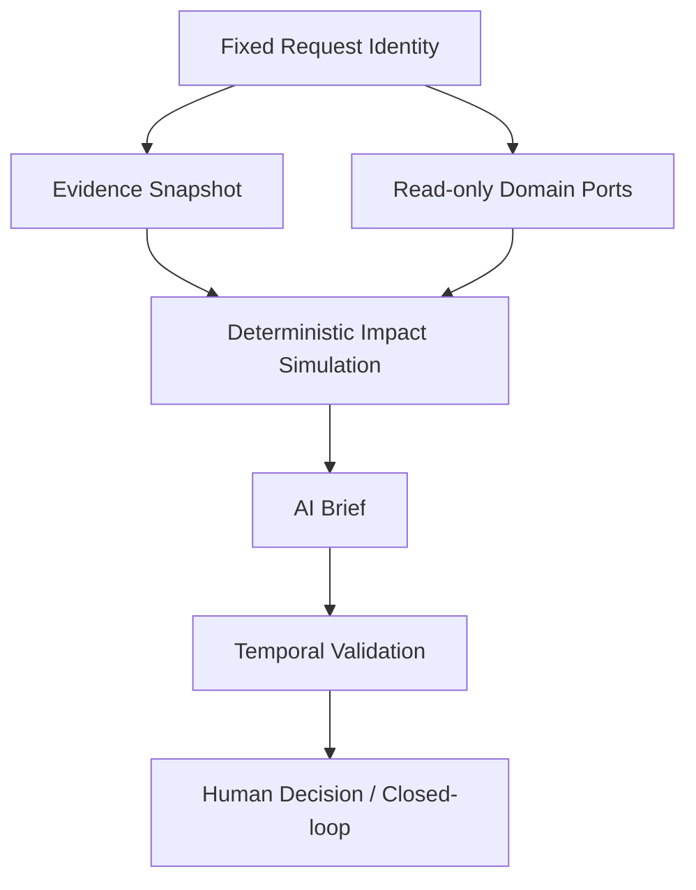

# Operational Domain Extension Plan

## Summary

이 문서는 현재 Evidence 중심 Agent Review 구조를 생산 운영 의사결정에 필요한 read-only
Operational Context로 확장하는 순서와 계약을 고정한다.

현재 `ContextProvider -> domain_sections -> AgentReviewPacket` 구조와 Product Result
Artifact/Evidence의 권위는 유지한다. 운영 데이터는 Product Evidence를 대체하거나 새로운 고장
확률을 만들지 않는다. LLM은 수집된 사실과 결정론적 계산 결과를 설명하며, 작업 생성·상태 변경·최종
선택은 사용자와 Backend Closed-loop가 소유한다.

최종 대상 흐름은 다음과 같다.

```text
Evidence Snapshot
  -> 필요한 Operational Context 조회
  -> 조건부 Impact Simulation
  -> AI Brief
  -> Evidence/Context Temporal Validation
  -> Human Decision
  -> Closed-loop
```

이 계획의 구현과 candidate freeze가 끝난 뒤에만
`2026-09-02-001-agent-workflow-final-evaluation-plan.md`의 live 최종 평가를 수행한다.

## Decision

### 확장 순서

1. Production Order, WIP, Alternative Resource/Capacity
2. Maintenance Window
3. Spare Part, Technician/Skill Readiness
4. Quality/Lot, Customer/Delivery Impact
5. 관계 기반 Context Resolver 고도화
6. 관계 복잡성이 실제로 입증된 경우에만 Knowledge Graph 검토
7. 동적 tool-call branching, durable pause/resume 필요성이 입증된 경우에만 LangGraph 검토

SOP revision, 유사 이력 확장, KG/LangGraph 실험을 생산 영향 판단보다 먼저 승격하지 않는다.

### 현재 packet getter와 미래 runtime tool 구분

현재 `agent_context_tool_pipeline.py`의 기본 executor는 신뢰된 `AgentReviewPacket` section을
선택적으로 반환하는 eval-only packet getter다. 현재 검증된 것은 tool selection, read-only boundary,
source-ref subset, bounded retry와 trajectory다.

미래 runtime tool은 다음 조건을 만족하는 별도 bounded read-only port다.

- 실행 시점에 도메인 owner의 read model을 조회한다.
- 각 도메인이 독립 version, freshness, timeout, retry 정책을 가진다.
- tool 결과는 공통 context envelope를 반환한다.
- LLM이 tenant/project/workspace/asset scope를 선택하거나 변경하지 않는다.
- Closed-loop mutation port와 같은 registry에 등록하지 않는다.
- 실패 시 값을 추측하지 않고 gap 또는 unavailable 상태를 반환한다.

## Current Evidence State

| Capability | Evidence State | Architecture Fit | Current Evidence |
|---|---|---|---|
| Evidence 중심 read-only Agent 구조 | Verified | Pass | ContextProvider, domain_sections, packet/summary tests |
| Synthetic production planning context | Verified | Pass | operation-context schema, fixture, ViewModel consumer |
| Packet section tool routing | Verified | Pass | eval-only pipeline과 trajectory tests |
| Fixed identity/context envelope contract | Verified | Pass | immutable schema, freshness/scope/version validator와 contract tests; runtime 미연결 |
| 실제 DB runtime domain tool | Not Proven | Unknown | executor seam만 존재 |
| Production Order/WIP/Alternative Capacity 확장 | Not Proven | Unknown | 통합 source/port 계약 없음 |
| Maintenance/part/technician readiness 확장 | Not Proven | Unknown | 일부 fixture/backlog만 존재 |
| Dynamic context temporal validation | Not Proven | Risk | Evidence Snapshot guard만 구현 |
| Deterministic Impact Simulation | Not Proven | Unknown | 기존 production impact/What-if 기반만 존재 |
| KG/LangGraph 필요성 | Not Proven | Pass | 도입 보류가 현재 결정 |

문서 또는 fixture가 존재한다는 이유만으로 runtime 구현 완료를 주장하지 않는다. 각 구현 단위는
code, contract, test, consumer 또는 실제 service/DB trace 중 두 종류 이상의 독립 증거가 있을 때만
`Verified`로 승격한다.

## Source-of-Truth and Authority Boundary

| Information | Canonical Owner | AI Usage | Forbidden |
|---|---|---|---|
| model score | Generator Model Artifact/Prediction Result Batch | 근거 설명 | LLM 재계산 |
| risk judgment, Product Result | Backend Product Result Artifact | 읽기 전용 설명 | 운영 context로 덮어쓰기 |
| Evidence projection | Backend Evidence | source refs와 한계 설명 | raw fixture를 최신 Evidence로 사용 |
| production order/plan | Production domain read model | 일정·수량·우선순위 맥락 | 실제 MES/ERP 연동 없이 actual 주장 |
| WIP/lot | Production/Quality read model | 영향 대상 범위 | 누락값을 0으로 대체 |
| asset capacity/alternative | Operations read model | 조건부 흡수 가능량 계산 | 가용성을 LLM이 추측 |
| maintenance window | Maintenance read model | 실행 가능한 시간대 설명 | 자동 일정 확정 |
| part inventory/readiness | Inventory read model | 준비 상태와 부족분 | 후보 부품을 실제 재고로 표현 |
| technician/skill readiness | Workforce/Maintenance read model | 자격·가용 시간 확인 | 개인 배정 또는 출동 명령 |
| recommendation | deterministic policy 또는 approved candidate | 설명·요약 | LLM이 최종 행동 선택 |
| execution state | Backend Closed-loop | 상태와 결과 설명 | AI가 직접 mutation |

실제 CMMS/WMS/MES/ERP 연동 전에는 synthetic master/context와 plan/candidate 데이터만 허용한다.
실행 사실은 생성하지 않으며 `not_connected`, `unknown`, `not_measured` 또는 evidence gap으로
남긴다.

## Request Identity Contract

Identity와 scope는 요청 시작 시 인증·application layer에서 확정한다.

```json
{
  "organization_id": "ORG-001",
  "project_id": "PROJECT-001",
  "workspace_id": "WORKSPACE-001",
  "asset_id": "CNC-02",
  "evidence_snapshot_id": "ARTIFACT-001",
  "decision_as_of": "2026-09-02T10:00:00Z"
}
```

- LLM과 situation router는 identity를 선택, 보정, 확장하지 않는다.
- 모든 domain port는 같은 scope를 입력받고 authorization을 재검증한다.
- 다른 project/workspace/asset 결과가 반환되면 전체 context 수집을 실패시킨다.
- `decision_as_of`는 조회 결과의 시간 비교 기준이지 최신값을 가장하는 timestamp가 아니다.

## Operational Context Envelope

모든 runtime domain tool 결과는 최소한 다음 envelope를 사용한다.

```json
{
  "owner_domain": "inventory",
  "scope": {
    "organization_id": "ORG-001",
    "project_id": "PROJECT-001",
    "workspace_id": "WORKSPACE-001",
    "asset_id": "CNC-02"
  },
  "status": "available",
  "source_version": "inventory-snapshot-42",
  "source_updated_at": "2026-09-02T10:01:00Z",
  "retrieved_at": "2026-09-02T10:01:03Z",
  "as_of": "2026-09-02T10:00:00Z",
  "freshness": {
    "policy_version": "inventory-freshness-v1",
    "max_age_seconds": 60,
    "state": "fresh"
  },
  "source_refs": [],
  "data": {},
  "limitations": []
}
```

허용 상태는 `available`, `unavailable`, `not_connected`, `stale`, `unauthorized`,
`failed`다. `data`가 없을 때 숫자 0, 정상, 재고 있음, 담당자 가능과 같은 의미를 합성하지 않는다.

## Domain Scope

### D1. Production Order and WIP

최소 필드:

- order ID, product/item, required quantity, completed quantity
- WIP quantity와 lot IDs
- due time, priority, operation/routing step
- assigned asset/resource
- plan version과 updated time
- synthetic/connected source classification

기존 `production-planning-context-v1.json`과
`production-planning-assumptions.md`를 초기 synthetic baseline으로 재사용한다. 기존
`operation_context` 필드를 깨지 않고 versioned domain section으로 additive 확장한다.

### D2. Alternative Resource and Capacity

최소 필드:

- compatible alternative asset/resource
- available time window
- deterministic capacity basis
- setup/changeover time
- transferable quantity
- compatibility limitations와 source refs

대체설비가 등록돼 있다는 사실과 현재 사용할 수 있다는 사실을 분리한다. availability가 없으면
흡수 가능량을 계산하지 않는다.

### D3. Maintenance Window

최소 필드:

- earliest start, latest finish
- expected duration 또는 range
- production blackout/allowed window
- active work order conflict
- maintenance policy/version
- approval requirement

정비창은 추천 후보의 입력이며 Closed-loop 일정 확정이나 작업 시작 사실이 아니다.

### D4. Spare Part Readiness

최소 필드:

- required part IDs와 quantities
- on-hand, reserved, available quantities
- storage/location reference
- expected replenishment time
- inventory snapshot version
- compatible/substitute 여부와 승인 필요성

현재 packet의 `spare_part_candidate`는 후보 관계다. 실제 inventory readiness로 승격하지 않는다.

### D4.1 MaintenanceAction-Part Relationship

부품 관계의 중심은 component가 아니라 실제 조치 lifecycle이다. 기존
`MaintenanceActionCandidate -> approved WorkOrder -> MaintenanceAction -> MaintenanceEvent` 흐름에
부품 요구·준비·사용 관계를 additive하게 연결한다.

```text
MaintenanceActionCandidate
  -> proposes ActionCode
  -> derives PartRequirement candidate

Approved WorkOrder
  -> creates MaintenanceAction(planned)
  -> confirms PartRequirement

PartRequirement
  -> references compatible Part candidates
  -> checked_by InventorySnapshot
  -> optionally fulfilled_by PartReservation

MaintenanceAction(in_progress/completed)
  -> records PartIssue / PartUsage
  -> installs_on or removes_from Equipment/Component

MaintenanceEvent
  -> references confirmed PartUsage
  -> records outcome
```

#### Ownership

| Object | Owner Domain | Meaning |
|---|---|---|
| `MaintenanceActionCandidate` | Maintenance | 검사 결과에서 파생된 조치 후보 |
| `PartRequirement` | Maintenance | 해당 조치에 필요한 part/spec/quantity |
| `PartCompatibility` | Equipment/Maintenance reference | part가 component/action에 사용 가능한 근거 |
| `InventorySnapshot` | Inventory | 특정 version/as-of의 on-hand/reserved/available |
| `PartReservation` | Inventory | 승인된 조치를 위해 확보된 수량 |
| `PartIssue` / `PartUsage` | Inventory + Maintenance handoff | 출고 수량과 실제 사용·미사용 결과 |
| `MaintenanceEvent` | Maintenance | 완료된 조치와 part usage를 참조하는 immutable 결과 |

MaintenanceAction이 inventory 수량을 직접 소유하거나 복사하지 않는다. readiness 조회 결과는
InventorySnapshot version을 참조하고, 실제 예약·출고·사용은 별도 command와 persisted ID로 남긴다.

#### Required Relationships

- `action_candidate_suggests_part_requirement`
- `maintenance_action_requires_part`
- `part_is_compatible_with_component`
- `inventory_snapshot_reports_part`
- `part_reservation_allocated_to_action`
- `part_issue_issued_for_action`
- `part_usage_consumed_by_action`
- `part_usage_installed_on_component`
- `part_usage_removed_from_component`
- `maintenance_event_confirms_part_usage`

각 관계에는 source/target ID, scope, source ref, version/as-of와 상태를 남긴다.

#### Lifecycle Boundary

| Stage | Permitted Part Meaning | Forbidden Claim |
|---|---|---|
| action candidate | 필요할 수 있는 부품 후보 | 실제 필요·확보 확정 |
| WorkOrder approved/action planned | 확인된 요구 부품 | 이미 출고·사용됨 |
| readiness check | snapshot 기준 available/reserved 상태 | 작업 시점에도 반드시 존재 |
| reservation | 해당 action에 할당된 수량 | 실제 사용 완료 |
| issue | 창고에서 출고된 수량 | 설비에 설치 완료 |
| action completed | 사용·미사용·반납·설치/제거 결과 | 기록 없이 재고 자동 차감 |
| maintenance event | 완료된 action과 usage의 immutable 참조 | 정비 효과 또는 정상화 자동 단정 |

후보 단계의 `spare_part_candidate`와 현재 fixture의 `spare_part_available` boolean은 actual
InventorySnapshot이나 reservation 증거로 승격하지 않는다.

#### Part Requirement Contract

```json
{
  "part_requirement_id": "PREQ-001",
  "maintenance_action_id": "ACTION-001",
  "action_code": "TOOL_REPLACEMENT",
  "target_component_id": "tooling",
  "required_part_spec": "TOOL-INSERT-TYPE-A",
  "required_quantity": 1,
  "acceptable_part_ids": ["PART-001", "PART-002"],
  "compatibility_refs": [],
  "requirement_version": "part-requirement-v1",
  "status": "confirmed"
}
```

action candidate 단계에는 `maintenance_action_id` 대신 `action_candidate_id`를 사용하고
`status=candidate`로 제한한다.

#### Part Readiness Result

```json
{
  "part_requirement_id": "PREQ-001",
  "inventory_snapshot_version": "inventory-43",
  "as_of": "2026-09-02T10:00:00Z",
  "required_quantity": 1,
  "on_hand_quantity": 2,
  "reserved_for_other_actions": 2,
  "available_quantity": 0,
  "reservation_id": null,
  "readiness": "blocked",
  "limitations": []
}
```

`on_hand`와 `available`을 구분한다. 다른 action의 reservation을 무시해 준비 완료로 표시하지 않는다.

#### Agent and Closed-loop Boundary

bounded ReAct Agent는 다음만 할 수 있다.

- action/action candidate에 연결된 PartRequirement 조회
- compatible part와 inventory readiness 조회
- 부족, 대체 후보, lead time과 relation gap 설명
- planned-maintenance option이 part 때문에 계산 불가능하거나 blocked임을 표시

Agent는 reservation, issue, consumption, return 또는 installation record를 생성하지 않는다.
승인 후 별도 Inventory/Closed-loop command가 실행되고, Backend가 role, permission, action state,
scope, idempotency와 최신 inventory version을 검증한다.

### D5. Technician and Skill Readiness

최소 필드:

- required skill/certification
- eligible role/resource IDs
- availability window
- assignment/conflict 상태
- workforce snapshot version
- privacy-safe display fields

가용 후보와 실제 배정을 분리한다. AI는 담당자를 배정하거나 개인 일정을 변경하지 않는다.

### D6. Quality/Lot and Delivery Impact

최소 필드:

- affected lot/WIP relationship
- quality hold/release state
- downstream order/delivery relationship
- due-date exposure
- explicit unknowns and limitations

품질 hold가 있는 경우 생산 영향값을 정상값으로 계산하지 않는다. 고객/납기 영향은 실제 관계가
연결된 경우에만 표시한다.

## Context-aware and Relational Product Capabilities

운영 도메인 확장의 산출물은 단순 필드 나열이나 “AI가 맥락을 이해했다”는 문장이 아니다. 사용자가
현재 위험이 어떤 주문·공정·설비·자원·실행 조건과 연결되는지 추적할 수 있는 구조화된 관계 결과와
역할별 기능으로 검증한다.

### Context Understanding Contract

시스템은 다음 질문에 구조화된 근거로 답할 수 있어야 한다.

- 왜 이 위험을 지금 확인해야 하는가?
- 어떤 Production Order, WIP, lot와 납기가 영향을 받는가?
- 해당 공정을 대신 수행할 수 있는 설비와 실제 가용 capacity는 얼마인가?
- 정비 가능한 시간대와 현재 생산계획이 충돌하는가?
- 필요한 부품과 기술 인력이 준비됐는가?
- 지금 정지, 계획 정비, 계속 운전 각각에서 어떤 조건과 잔여 영향이 남는가?
- 결론을 내리기 위해 부족하거나 오래된 맥락은 무엇인가?
- 이전 brief 이후 어떤 Evidence 또는 운영 context version이 바뀌었는가?

이 답은 LLM의 암묵적 추론만으로 만들지 않는다. 관계 resolver와 결정론적 계산이
`facts`, `relationships`, `constraints`, `gaps`, `option_impacts`를 먼저 만들고 LLM은 이를
역할별 언어로 표현한다.

### Relationship Model

최소 관계 경로는 다음과 같다.

```text
Evidence Snapshot
  -> observed_asset
  -> assigned_operation
  -> production_order
  -> WIP / quality_lot
  -> delivery_commitment

assigned_operation
  -> primary_asset
  -> compatible_alternative_asset
  -> available_capacity

maintenance_candidate
  -> maintenance_window
  -> required_part
  -> inventory_readiness
  -> required_skill
  -> technician_readiness
  -> approval / work_execution
```

모든 관계 결과는 `relationship_type`, source/target identity, `source_refs`, source version,
`as_of`, confidence가 아니라 **관계 사실의 상태**를 가진다. 상태는 `verified`, `assumed_demo`,
`not_connected`, `unknown`, `conflicting`으로 구분한다. 단순히 같은 이름이나 LLM 의미
유사도만으로 운영 관계를 생성하지 않는다.

### Structured Context Result

관계 resolver는 최소한 다음 shape를 반환한다.

```json
{
  "focus": {
    "evidence_snapshot_id": "ARTIFACT-001",
    "asset_id": "CNC-02",
    "decision_as_of": "2026-09-02T10:00:00Z"
  },
  "facts": [],
  "relationships": [],
  "constraints": [],
  "gaps": [],
  "conflicts": [],
  "available_options": [],
  "context_version_set": {},
  "source_refs": []
}
```

LLM prompt에는 raw DB row나 전체 도메인 dump 대신 이 bounded result와 결정론적 simulation 결과만
전달한다.

### User-facing Features and Outputs

| Feature | Structured Output | User Value | Authority Boundary |
|---|---|---|---|
| 지금 봐야 하는 이유 | risk, due time, affected WIP, constraint summary | 우선순위 이해 | 기존 risk 판단을 변경하지 않음 |
| 영향 범위 추적 | Evidence→Asset→Order→WIP/Lot→Delivery path | 영향 대상을 추적 | 연결되지 않은 대상을 추측하지 않음 |
| 대체설비 탐색 | compatibility, window, capacity, limitation | 전환 가능성 확인 | 전환 명령·확정 금지 |
| 정비 준비도 체인 | window→part→skill→technician→approval | 실행 전 blocker 확인 | 배정·승인·작업 시작 금지 |
| 선택지 비교 | stop/planned/continue별 계산값과 조건 | 사람이 trade-off 비교 | 최적안 자동 선택 금지 |
| 맥락 gap/conflict | stale, missing, not_connected, conflicting source | 잘못된 확신 방지 | 누락값 합성 금지 |
| 변경점 설명 | 이전/현재 context version diff | brief가 달라진 이유 확인 | immutable 과거 결과 유지 |
| 역할별 AI Brief | 생산/현장/정비 관점의 동일 근거 표현 | 인수인계 비용 감소 | LLM은 표현만 담당 |
| Decision handoff | 선택한 option, 근거 refs, context versions | Closed-loop 입력 기준 보존 | 사람 선택 후에만 생성 |
| Report snapshot | Evidence/context/simulation version bundle | 사후 감사·재현 | 최신값으로 과거 결과 덮어쓰기 금지 |

### Role-specific Expression

- `process_manager`: 주문/WIP/납기 영향, 대체 capacity, 선택지별 잔여 영향과 승인 우선순위
- `process_engineer`: 위험 근거, 관련 component/operation, 점검 위치, 데이터 gap과 추가 확인사항
- `maintenance_technician`: 정비창, 필요 부품·공구·skill, 준비 blocker, 승인된 WorkOrder 상태
- `system_admin`: tool call, source/version/freshness, retry/failure, scope/authorization trace

역할별 표현은 동일한 context result를 재해석한다. 역할마다 별도 사실 또는 별도 판단 결과를 만들지
않는다.

### Concrete Capability Catalog

#### C1. Situation Context Frame

같은 위험이라도 사용자 역할, 판단 시점, 연결된 주문과 실행 상태에 따라 필요한 설명이 달라진다.
먼저 다음 context frame을 결정론적으로 구성한다.

```json
{
  "focus_event": "EVT-GS-004",
  "decision_as_of": "2026-09-02T10:00:00Z",
  "actor_role": "process_manager",
  "intent": "maintenance_timing_decision",
  "current_state": {
    "risk": "critical",
    "asset": "CNC-02",
    "active_operation": "OP-MILL-20"
  },
  "active_constraints": [
    "PO-001 due before planned maintenance end",
    "PART-BRG-02 availability not connected"
  ],
  "relevant_changes": [],
  "context_version_set": {}
}
```

산출 기능:

- 현재 사용자가 내려야 할 판단의 종류 식별
- 현재 사건과 무관한 domain section 제외
- 역할별 우선 정보 순서 결정
- 판단을 막는 constraint와 gap 우선 노출
- 같은 Evidence라도 판단 시점과 운영 상태가 달라졌는지 식별

검증 기준:

- 동일 identity, role, intent, version set이면 동일 frame 생성
- LLM 없이 frame을 생성할 수 있음
- role이 달라도 facts와 relationship truth는 같고 정렬·표현 우선순위만 달라짐

#### C2. Why-now Brief

사용자가 “왜 지금 봐야 하는가”를 한 화면에서 이해하도록 다음 구조를 만든다.

```json
{
  "headline_basis": "critical risk on CNC-02",
  "time_pressure": "PO-001 due in 8 hours",
  "affected_scope": {
    "wip_units": 200,
    "lot_ids": ["DEMO-LOT-014", "DEMO-LOT-015"]
  },
  "decision_blockers": [
    "spare-part inventory not connected"
  ],
  "source_refs": []
}
```

표현 예시:

> CNC-02의 현재 위험은 critical입니다. 이 설비에는 8시간 내 납기인 PO-001의 WIP 200개가
> 연결돼 있습니다. 대체설비 capacity는 확인됐지만 부품 재고가 연결되지 않아 계획 정비의
> 실행 가능 여부는 아직 확정할 수 없습니다.

숫자와 관계는 structured result에서 가져오며 LLM은 문장만 만든다.

#### C3. Relationship Impact Map

운영 영향은 단일 설비 카드가 아니라 추적 가능한 경로로 표현한다.

```text
EVT-GS-004
  -> evidenced_by ARTIFACT-001
  -> affects CNC-02
  -> executes OP-MILL-20
  -> assigned_to PO-001
  -> contains WIP 200
  -> includes LOT-014, LOT-015
  -> commits DELIVERY-009
```

지원 표현:

- **경로형:** 사건에서 주문·lot·납기까지 원인/영향 경로
- **의존 체인:** 정비 실행에 필요한 window·part·skill·approval
- **분기형:** primary asset과 alternative asset 후보
- **시간축:** Evidence 관측, context 조회, 정비 가능 시간, 납기
- **변경 diff:** 이전 brief와 현재 context version의 관계·값 변화
- **충돌 표현:** 서로 다른 source가 같은 가용성/수량에 다른 값을 제공한 경우

각 edge를 눌렀을 때 relationship type, owner domain, source ref, version, as-of와 상태를 확인할 수
있어야 한다. 관계가 없는 것과 아직 연동되지 않은 것을 구분한다.

#### C4. Alternative Capacity Explorer

대체설비 후보를 “있음/없음”이 아니라 실제 조건과 함께 표현한다.

| Candidate | Compatibility | Available Window | Verified Capacity | Setup Time | Remaining Impact | State |
|---|---:|---|---:|---:|---:|---|
| CNC-03 | compatible | 11:00–15:00 | 50 units | 30 min | 150 units | assumed_demo |
| CNC-04 | unknown | not connected | not calculable | unknown | not calculable | not_connected |

산출 기능:

- 공정·제품·tooling 조건에 맞는 후보 필터링
- availability와 compatibility 분리
- setup/changeover 반영 capacity 계산
- 이전/이후 잔여 영향 비교
- source가 부족한 후보는 순위에 끼워 넣지 않고 `not_calculable` 표시

#### C5. Maintenance Readiness Chain

정비 가능성을 하나의 점수로 감추지 않고 blocker chain으로 표현한다.

```text
Maintenance candidate
  -> Window: available 14:00–16:00
  -> Part: PART-BRG-02 inventory not connected
  -> Skill: vibration-level-2 required
  -> Technician: candidate available 13:30–17:00
  -> Approval: process_manager pending
  -> Execution: not started
```

readiness 결과:

```json
{
  "overall_state": "blocked",
  "ready": ["maintenance_window", "required_skill_candidate"],
  "blocked": ["part_inventory"],
  "pending": ["human_approval"],
  "not_started": ["work_execution"]
}
```

`overall_state`는 정해진 readiness rule로 계산한다. LLM이 부품 부족과 승인 대기를 임의 가중치로
합쳐 점수를 만들지 않는다.

#### C6. Conditional Option Comparison

세 선택지는 권고 순위가 아니라 동일 조건에서 비교 가능한 표로 제공한다.

| Option | Preconditions | Production Available | Alternative Absorption | Remaining Exposure | Maintenance Readiness | Limitations |
|---|---|---:|---:|---:|---|---|
| 지금 정지 | 즉시 정지 승인 | 계산값 | 계산값 | 계산값 | 부품 확인 필요 | 실제 손실 예측 아님 |
| 계획 정비 | window·부품·담당자 준비 | 계산값 | 계산값 | 계산값 | blocked/ready | inventory 미연동 |
| 계속 운전 | 사람 승인·추가 관측 | 계산값 | 계산값 | 계산값 | not applicable | 고장확률 재계산 아님 |

사용자는 각 계산값을 펼쳐 input, formula, intermediate value, source version을 확인할 수 있다.
시스템은 “최선”, “권장”, “반드시”를 자동 산출하지 않는다.

#### C7. Context Gap and Conflict Inspector

의사결정을 방해하는 데이터 문제를 별도 기능으로 제공한다.

- **missing:** 필요한 domain result가 없음
- **not_connected:** source system 연동 전
- **stale:** freshness policy 초과
- **unauthorized:** 현재 scope/role로 조회 불가
- **conflicting:** 같은 관계·수량에 source 간 충돌
- **not_calculable:** simulation 필수 입력 부족

각 gap은 `blocks_options`, `required_owner`, `required_data`, `last_known_version`을 제공한다.
“재고를 확인하세요”가 아니라 어떤 선택지 계산을 왜 막는지 표현한다.

#### C8. What-changed Explanation

이전 brief와 현재 brief를 단순 텍스트 diff가 아니라 versioned context diff로 설명한다.

```json
{
  "changed_domains": ["inventory", "production"],
  "changes": [
    {
      "path": "inventory.PART-BRG-02.available_quantity",
      "before": 1,
      "after": 0,
      "source_version_before": "inventory-42",
      "source_version_after": "inventory-43"
    }
  ],
  "invalidated_outputs": ["planned_maintenance impact", "previous AI brief"]
}
```

산출 기능:

- 어떤 domain version이 바뀌었는지 표시
- 기존 선택지 계산과 AI Brief가 폐기된 이유 설명
- 변경되지 않은 Evidence와 변경된 Operational Context 분리
- 과거 snapshot을 덮어쓰지 않고 audit 가능하게 보존

#### C9. Role Handoff Briefs

동일한 context result에서 역할별 handoff를 만든다.

| Role | First Question | Required Output |
|---|---|---|
| process_manager | 언제 정비해야 생산 영향을 통제할 수 있는가? | 주문/WIP/납기, 대체 capacity, 선택지 비교 |
| process_engineer | 위험 근거와 현장 확인 지점은 무엇인가? | factor/component/location, gap, 검사 항목 |
| maintenance_technician | 실제 작업 준비를 막는 것은 무엇인가? | window, part, skill, 승인된 WorkOrder |
| system_admin | 결과가 어떤 조회와 버전에서 만들어졌는가? | tool trace, source/version/freshness, retry |

역할별 brief 사이에 수량·상태·관계가 다르면 validation failure다.

#### C10. Decision Handoff Package

사람이 선택한 뒤에만 Closed-loop에 전달할 immutable handoff package를 만든다.

```json
{
  "selected_option": "planned_maintenance",
  "selected_by": "USER-001",
  "selected_at": "2026-09-02T10:05:00Z",
  "evidence_snapshot_id": "ARTIFACT-001",
  "context_version_set": {
    "production": "plan-17",
    "inventory": "inventory-43",
    "maintenance": "window-08",
    "workforce": "workforce-12"
  },
  "simulation_result_id": "SIM-001",
  "assumptions": [],
  "source_refs": []
}
```

이 package는 작업 생성 명령 자체가 아니다. Closed-loop가 권한, object state, scope, lineage와 최신
version을 다시 검증한 뒤 허용된 action만 노출한다.

#### C11. MaintenanceAction Part Trace

MaintenanceAction 상세에서 다음 관계를 한 흐름으로 확인한다.

```text
ACTION-001 TOOL_REPLACEMENT
  -> requires PREQ-001 quantity 1
  -> compatible PART-001/PART-002
  -> inventory-43 available quantity 0
  -> reservation none
  -> issue none
  -> usage none
  -> execution blocked
```

작업 완료 후에는 같은 화면이 reservation, issue, consumed/returned quantity, installed/removed component와
MaintenanceEvent까지 추적한다. 계획과 실제의 차이를 별도로 표시하며, 현재 상태에 존재하지 않는
lifecycle 단계를 미리 생성하지 않는다.

### Capability Acceptance Matrix

| Capability | Deterministic Evidence | Consumer Evidence | Failure Evidence |
|---|---|---|---|
| Situation Context Frame | 동일 입력 재현 테스트 | 역할별 brief/API | scope mismatch 차단 |
| Why-now Brief | source-backed fact set | UI headline/detail | 누락 수치 미표현 |
| Relationship Impact Map | edge/source contract | graph/table/path UI | unknown edge 미생성 |
| Alternative Explorer | capacity formula test | comparison table | unavailable 후보 계산 차단 |
| Readiness Chain | readiness rule test | blocker UI | missing part에서 ready 금지 |
| Option Comparison | option policy test | expandable calculation | stale input에서 not_calculable |
| Gap/Conflict Inspector | 상태 분류 test | warning/detail UI | conflict 은폐 금지 |
| What-changed | version diff test | previous/current comparison | stale brief reuse 차단 |
| Role Handoff | cross-role consistency | 역할별 화면 | 사실 불일치 validation failure |
| Decision Handoff | immutable package contract | Closed-loop preview | mutation 전 재검증 실패 차단 |
| MaintenanceAction Part Trace | action-part lifecycle relation test | action detail/readiness UI | 후보를 actual usage로 승격 금지 |

## Agent Topology Decision

### Single Bounded ReAct Agent

현재 단계에서는 멀티에이전트로 분리하지 않고 하나의
`Operational Decision Support Agent`를 bounded ReAct 방식으로 운영한다.

ReAct는 다음 loop를 뜻한다.

```text
Reason: 현재 판단에 필요한 다음 정보 결정
  -> Act: 허용된 read-only tool 호출
  -> Observe: versioned tool result와 gap/failure 확인
  -> Repeat or Stop: 추가 조회 필요성 또는 종료조건 판정
  -> Respond: 구조화된 context와 simulation을 역할별로 설명
```

자유로운 chain-of-thought를 저장하거나 노출하는 구조가 아니다. 시스템은 사용자에게 내부 추론문
대신 `selected_tool`, `selection_reason_code`, input/output refs, status, attempts, gap과 종료 사유를
구조화된 trajectory로 제공한다.

```text
Single Bounded ReAct Agent
  -> fixed identity/evidence 확인
  -> Situation Router
  -> domain-specific read-only tools
  -> deterministic Relation Resolver
  -> deterministic Impact Simulation
  -> Temporal Validator
  -> role-specific Decision Brief
```

### Agent Responsibility

에이전트가 소유하는 것은 조율과 표현이다.

- 사용자 역할과 판단 intent에 맞는 질문 계획 선택
- 허용된 도메인 tool 중 필요한 tool 선택
- 결과의 gap/failure를 보고 허용 범위 내 추가 조회
- 조회 순서와 bounded retry/fallback 조율
- deterministic resolver/simulator 결과를 역할별로 설명
- 판단 불가 조건과 사람에게 필요한 다음 확인사항 제시

에이전트가 소유하지 않는 것은 사실 확정, 수치 계산, 권한 판단과 실행이다.

- risk/criticality 생성 또는 변경
- 관계 edge 임의 생성
- capacity, readiness, impact 수치 계산
- source version/freshness 판정 우회
- 최적 option 자동 선택
- 담당자 배정, 승인, WorkOrder/command 생성
- tenant/project/workspace/asset scope 변경

### ReAct Tool Allowlist

| Tool | Purpose | Required/Optional | Mutation |
|---|---|---|---|
| `evidence.lookup` | 고정 Evidence Snapshot 조회 | required | forbidden |
| `production_order.lookup` | 주문·계획 조회 | conditional | forbidden |
| `wip_lot.lookup` | WIP·lot 영향 범위 | conditional | forbidden |
| `alternative_capacity.lookup` | 대체설비·capacity | conditional | forbidden |
| `maintenance_window.lookup` | 정비 가능 시간 | conditional | forbidden |
| `action_part_requirement.lookup` | action별 필요 부품·호환 관계 | conditional | forbidden |
| `part_readiness.lookup` | InventorySnapshot 기반 재고·예약 준비도 | conditional | forbidden |
| `technician_readiness.lookup` | skill·가용 후보 | conditional | forbidden |
| `quality_delivery.lookup` | 품질 hold·납기 관계 | conditional | forbidden |
| `relation.resolve` | source-backed 관계 경로 구성 | required after context | forbidden |
| `impact.simulate` | 세 option 결정론적 계산 | intent-dependent | forbidden |
| `temporal.validate` | 저장 전 version 재검증 | required | forbidden |

Closed-loop mutation tool은 이 allowlist와 Agent registry에 포함하지 않는다. 사람이 option을 선택한
후 별도 application command 경계에서 Backend가 `available_actions`와 권한을 다시 계산한다.

### Bounded Execution Policy

최초 정책은 설정과 trace에 version을 남기고 다음 상한을 가진다.

- 최대 reasoning/tool loop: 8회
- 같은 tool의 최대 호출: 최초 1회와 freshness/retry 목적의 재호출 1회
- retry: retryable transport failure만 bounded retry
- scope mismatch, unauthorized, invalid schema: fail-fast
- stale result: 1회 재조회 후 계속 stale이면 terminal gap
- 필수 Evidence 또는 identity 실패: 전체 중단
- optional context 실패: 영향받는 option을 `not_calculable`로 제한하고 계속 가능
- simulation 입력이 충분하면 불필요한 domain fan-out 금지
- 같은 input/version/tool의 중복 호출 금지
- 호출 예산 초과 시 임의 답변 대신 `insufficient_context` 종료

정확한 횟수는 integration trace로 조정하되 무제한 loop와 silent retry는 허용하지 않는다.

### Stop Conditions

다음 중 하나면 tool loop를 종료한다.

- intent에 필요한 필수 context와 simulation 결과가 모두 준비됨
- 필수 source가 unavailable/not_connected여서 더 이상 계산할 수 없음
- scope/authorization/schema 위반 발생
- freshness 재조회 상한 초과
- 최대 loop/tool budget 도달
- 사용자의 추가 선택이나 확인이 필요함

종료 결과는 `complete`, `partial_with_gaps`, `blocked`, `failed`,
`human_input_required`로 기록한다.

### ReAct Trajectory Contract

각 step은 최소한 다음 정보를 기록한다.

```json
{
  "step": 3,
  "selected_tool": "part_readiness.lookup",
  "selection_reason_code": "PLANNED_MAINTENANCE_REQUIRES_PART",
  "input_scope_hash": "sha256:...",
  "input_context_versions": {},
  "attempt_count": 1,
  "status": "not_connected",
  "output_ref": null,
  "source_refs": [],
  "next_action": "mark_option_not_calculable"
}
```

자연어 내부 사고 과정은 관측성·감사 근거로 사용하지 않는다. 평가에서는 reason code와 실제
tool 필요성, 금지 tool 미호출, source/version 연결 여부를 검증한다.

### Current-to-Target Migration

| Stage | Behavior | Evidence State |
|---|---|---|
| Current | packet section을 Situation Router가 선택 | Verified |
| Stage 1 | 동일 packet getter를 bounded ReAct executor contract로 실행 | Not Proven |
| Stage 2 | 일부 tool을 격리 DB read port로 교체 | Not Proven |
| Stage 3 | domain별 freshness/retry와 relation resolver 적용 | Not Proven |
| Stage 4 | Impact Simulation과 temporal revalidation 연결 | Not Proven |
| Stage 5 | 실제 service/DB reliability 및 live quality 평가 | Not Proven |

한 번에 모든 getter를 runtime DB tool로 교체하지 않는다. Production/WIP/Alternative Capacity vertical
slice에서 trajectory와 failure boundary를 먼저 검증한 뒤 Maintenance, Inventory, Workforce 순으로
교체한다.

### Why Not Multi-agent Yet

Production Agent, Maintenance Agent, Inventory Agent처럼 나누면 동일 Evidence와 `as_of`를 서로 다르게
읽거나, retry/state/권한과 최종 판단이 중복될 위험이 있다. 도메인 분리는 agent가 아니라 typed
port, schema, freshness policy와 test ownership으로 달성한다.

다음 조건이 둘 이상 실제 service trace에서 반복 확인될 때만 멀티에이전트 실험을 별도 검토한다.

- 도메인별 독립 장기 작업과 durable state가 필요함
- 서로 다른 권한 주체의 명시적 handoff가 필요함
- 한 context window에서 처리할 수 없는 독립 전문 reasoning이 존재함
- 병렬 조회가 아니라 독립 목표의 협상·조정이 필요함
- 단일 orchestrator의 retry/recovery 복잡도가 측정상 더 위험함
- 분리 후 품질·latency·failure isolation 개선을 같은 gold set으로 비교할 수 있음

멀티에이전트를 도입하더라도 Evidence identity, context version set, deterministic calculation과
Closed-loop authority는 공유 계약으로 고정하며 agent 합의가 운영 사실이나 승인으로 승격되지 않는다.

## Deterministic Impact Simulation

### Purpose

현재 위험과 운영 context를 사용해 아래 선택지의 조건부 영향을 비교한다.

1. `stop_now`: 지금 정지
2. `planned_maintenance`: 계획 정비
3. `continue_operation`: 계속 운전

이 결과는 실제 생산 손실 예측, 새로운 고장 확률, 최적 행동 또는 자동 추천이 아니다.

### Input

- immutable Evidence Snapshot identity
- Production Order와 WIP
- primary/alternative capacity
- maintenance duration/window
- part and technician readiness
- quality/lot/delivery constraints
- versioned assumptions와 calculation policy

### Calculation Boundary

결정론적 계산 모듈이 다음을 소유한다.

- 선택지별 available production time
- primary asset의 계획 생산 가능량
- alternative capacity의 흡수 가능량
- 미처리 WIP/주문 잔량
- 납기 window 초과 여부
- 정비 실행 가능 조건과 missing prerequisites

예시 계산식:

```text
gross_exposed_units = max(0, required_units_in_window - primary_capacity_after_action)
absorbed_units = min(gross_exposed_units, verified_alternative_capacity)
remaining_exposed_units = gross_exposed_units - absorbed_units
```

계산 결과에는 input refs, assumptions, formula/policy version, intermediate values와 limitation을 모두
남긴다. 데이터가 부족하거나 stale이면 `not_calculable`로 반환한다.

### LLM Boundary

LLM은 다음만 수행한다.

- 계산 결과와 근거를 역할별로 설명
- 선택지별 조건과 한계를 요약
- 누락된 운영 데이터와 추가 확인사항 설명

LLM은 계산식을 변경하거나, 확률·수량을 새로 만들거나, 최적 선택을 자동 결정하지 않는다.
최종 선택과 실행은 사용자와 Closed-loop가 담당한다.

## Temporal Validation Protocol

AI Brief 저장 또는 Closed-loop handoff 전에 다음 순서로 검증한다.

1. Evidence Snapshot identity와 checksum 재확인
2. 의사결정에 사용한 모든 dynamic context의 source version 재확인
3. freshness policy와 `as_of` 정합성 재평가
4. 하나라도 변경, stale, scope mismatch면 수집 context와 LLM 결과 폐기
5. 최신 Evidence와 context부터 재수집
6. bounded retry 초과 시 brief를 저장하지 않고 명시적 terminal/gap 상태 기록

동적 context version set은 brief와 decision candidate에 함께 저장한다. Evidence만 같고 inventory,
schedule, maintenance 또는 workforce version이 달라진 결과를 재사용하지 않는다.

## Target Architecture



Backend는 domain-first 구조를 유지한다. 각 도메인의 서비스와 저장소를 AI package가 직접 import하지
않고 public read port를 통해 조회한다. composition root가 port 구현을 주입한다.

## Implementation Units

### U0. Contract and Baseline Freeze

- 기존 operation-context schema/fixture/ViewModel consumer를 baseline으로 고정
- 기존 API compatibility test와 packet golden test 확보
- synthetic, connected, actual source wording 규칙 고정
- 기존 Evidence Snapshot identity 계약 재사용 범위 결정

### U1. Shared Request and Context Metadata

- **Status:** contract-only 구현 완료. Runtime domain port와 Agent workflow 연결은 U2/U6에서 수행한다.
- fixed identity request contract 구현
- domain result envelope와 status enum 구현
- source version/freshness/as-of validator 구현
- scope mismatch와 unavailable-value contract tests 추가

### U2. Production Decision Context

- **Status:** Partially Verified. typed synthetic ProductionOrder/WIP/Alternative Capacity source와 versioned read port, 관계 검증을 구현했다. 실제 MES/APS source와 Agent/ViewModel consumer 연결은 미구현이다.
- Production Order/WIP read port
- Alternative Resource/Capacity read port
- synthetic fixture와 격리 DB adapter
- operation context packet section의 additive 확장
- ViewModel/API/AgentReviewPacket consumer compatibility 검증

### U3. Maintenance Readiness Context

- **Status:** Partially Verified. synthetic Maintenance Window, ActionCandidate-PartRequirement, InventorySnapshot, Technician/Skill 후보와 결정론적 blocker 판정을 versioned read port로 구현했다. 실제 CMMS/WMS/인력 source 및 예약·출고·배정 command 연결은 미구현이다.
- Maintenance Window read port
- MaintenanceAction/ActionCandidate 기반 PartRequirement read contract
- Spare Part Readiness와 InventorySnapshot read port
- 승인 후 PartReservation/Issue/Usage command는 Agent 밖 Closed-loop 경계로 분리
- Technician/Skill Readiness read port
- 부품 후보/요구/재고/예약/출고/사용과 담당자 후보/배정/실행 상태 분리
- 독립 timeout/retry/freshness tests

### U4. Quality and Delivery Context

- Quality/Lot read port
- Customer/Delivery relationship read port
- quality hold와 missing relationship에서 impact 계산 차단
- 역할별 UI/brief 노출 범위 검증

### U5. Impact Simulation

- 제품 코드의 결정론적 simulation policy와 versioned result contract 구현
- 세 선택지 계산과 `not_calculable` 처리
- assumptions/formula/intermediate values/source refs 보존
- LLM 입력에는 계산 완료 결과만 전달
- 자동 action/WorkOrder side effect 0건 검증

### U6. Runtime Context Orchestration

- packet getter와 runtime DB executor를 명시적으로 분리
- single bounded ReAct executor와 versioned execution policy 구현
- allowlist, loop/tool budget, stop condition과 reason code 구현
- 필요한 도메인만 호출하는 bounded resolver
- domain별 timeout/retry/gap policy
- context version set을 summary key/materialization에 포함
- 저장 직전 temporal revalidation과 stale discard/recollect 구현

### U7. Relation Resolver Decision Gate

- flat IDs와 indexed RDB read model로 동일 질문을 먼저 해결
- 관계 질문 정확도, query complexity, latency와 변경 비용을 기록
- RDB 경계가 실제로 부족한 경우에만 KG 실험
- 독립 tool branching/복구 상태가 service method를 넘는 경우에만 LangGraph 실험

## Verification Strategy

### Contract and Unit

- identity/scope mismatch 차단
- domain envelope required metadata
- unavailable/stale/unauthorized 상태에서 값 합성 금지
- capacity/impact formula deterministic repeatability
- quality hold와 missing prerequisite에서 `not_calculable`
- LLM 없이 동일 입력/정책 버전은 동일 simulation 결과

### Integration

- 각 read port가 격리 DB에서 versioned snapshot 조회
- domain별 timeout/retry/fallback이 독립적으로 기록
- context version 변경 시 summary reuse 차단
- brief 저장 직전 version mismatch 감지 및 재수집
- Product Result/Evidence immutable 유지
- WorkOrder/MaintenanceAction side effect 0건

### Consumer

- API와 ViewModel이 source classification, freshness, limitation을 보존
- AgentReviewPacket이 raw DB row가 아니라 bounded domain result를 소비
- AI Brief가 simulation 결과를 설명하되 새 수치를 만들지 않음
- UI가 unknown/not_connected/not_calculable을 0 또는 정상으로 표시하지 않음

### Evaluation

확장 구현 중 결과는 smoke/regression evidence로만 사용한다. U0~U7 완료와 candidate freeze 이후:

1. deterministic contract/integration tests
2. 실제 service/DB reliability evaluation
3. B1/B2/B3 live comparison
4. LLM gold quality live evaluation
5. concurrency/pressure run
6. 사람 표본 검토
7. 최종 통합 리포트

## Completion Gates

- fixed identity와 authorization boundary 구현
- 모든 dynamic domain 결과에 version/freshness/as-of metadata 존재
- Production Order/WIP/Alternative Capacity consumer path 검증
- Maintenance Window/Part/Technician readiness consumer path 검증
- MaintenanceAction→PartRequirement→InventorySnapshot/Reservation→PartUsage→MaintenanceEvent 관계 검증
- 후보 부품이 실제 재고·예약·사용 사실로 승격되지 않음
- Quality/Lot/Delivery context의 연결 여부와 gap 표현 검증
- 세 선택지 Impact Simulation의 결정론적 contract 검증
- simulation 결과에 assumptions/formula/intermediate values/source refs 보존
- LLM이 계산·결정·mutation을 소유하지 않음
- context version 변경 시 stale brief 저장 및 reuse 차단
- ReAct allowlist, loop budget, stop condition과 structured trajectory 검증
- 불필요한 tool fan-out과 같은 input/version 중복 호출 차단
- 내부 자연어 추론이 아니라 reason code/source refs/version으로 trajectory 감사
- Product Result Artifact/Evidence와 operational state 소유권 분리 유지
- actual runtime integration이 없으면 synthetic/not_connected 표시 유지
- KG/LangGraph는 decision gate 전 production dependency로 추가하지 않음
- 구현 완료 후 final evaluation candidate SHA 고정

## Non-goals

- 실제 고장 확률 재계산
- 실제 생산 손실 또는 비용 절감 효과 주장
- 자동 최적화나 자동 행동 선택
- 무제한 autonomous ReAct loop 또는 unrestricted tool calling
- 내부 chain-of-thought 저장·노출을 감사 근거로 사용하는 방식
- AI의 WorkOrder 생성, 승인, 일정 확정, 담당자 배정
- 미연동 CMMS/WMS/MES/ERP의 actual 실행 사실 합성
- 초기 단계의 graph database, vector database, LangGraph production 도입
- 모든 제조 MOM 도메인의 동시 완성

## Related Artifacts

- `docs/mvp/production-planning-assumptions.md`
- `contracts/schemas/operation-context.schema.json`
- `data/fixtures/operation_context/production-planning-context-v1.json`
- `docs/mvp/preventive-what-if-development-plan.md`
- `docs/plans/2026-08-26-001-runtime-simulation-closed-loop-plan.md`
- `docs/plans/ai-workflow/2026-08-29-001-ai-context-orchestration-adapter-plan.md`
- `docs/plans/ai-workflow/2026-09-02-001-agent-workflow-final-evaluation-plan.md`
