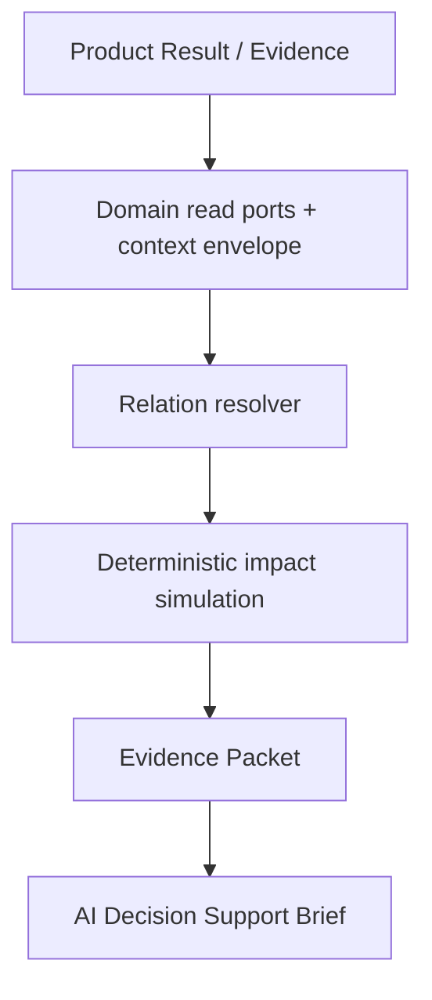
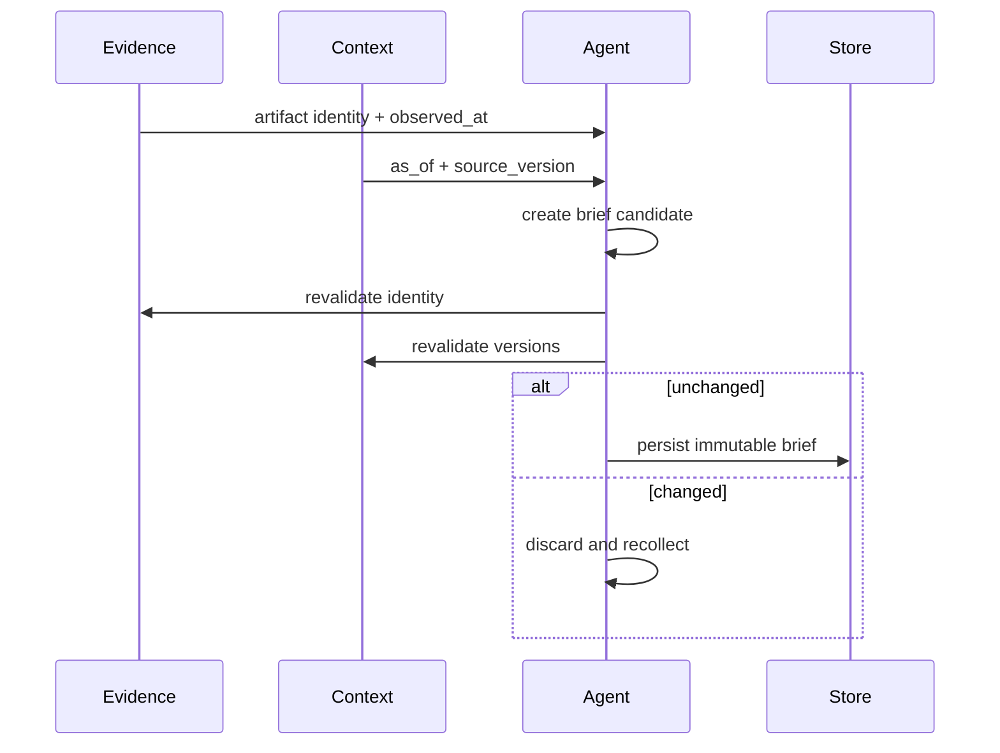

# AI Solution Engineer Presentation Frame Plan

## Purpose

이 문서는 Operational Decision Support 작업을 AI Solution Engineer 관점에서 설명하기 위한 발표 정본이다.
발표의 중심은 "LLM이 요약문을 만들었다"가 아니라, 서로 다른 시스템과 시점의 제조 데이터를 확장 가능한
계약으로 통합하고 사람이 신뢰할 수 있는 판단 맥락으로 전달한 설계와 검증이다.

기술 구현 계약은 `2026-09-02-002-operational-domain-extension-plan.md`, API/UI/E2E 실행 상세는
`2026-09-03-001-decision-support-api-ui-e2e-foundation-plan.md`, 평가 방법은
`2026-09-01-004-feat-agent-workflow-stability-evaluation-plan.md`를 따른다. 이 문서는 새 기능 계약이나
별도 평가 수치를 만들지 않는다.

## Presentation Thesis

### Project Problem

> 서로 다른 시스템과 시점에 존재하며 계속 확장되는 제조 데이터를 조직이 판단 가능한 운영 맥락으로
> 변환해야 한다.

### My Problem

> 예측·근거·운영 데이터를 동일 identity와 허용된 시점으로 묶고, 새로운 제조 도메인이 추가돼도 기존
> pipeline을 크게 바꾸지 않으면서 사람이 관계·제약·불확실성을 이해할 수 있는 Decision Support Brief로
> 변환해야 한다.

### Role Statement

> 다양한 제조 데이터를 확장 가능한 계약으로 통합하고, 시간과 근거의 정합성을 보존해 사람이 신뢰할 수
> 있는 판단 맥락으로 전달하는 AI 솔루션을 설계하고 검증했습니다.

안정성은 최상위 문제 정의가 아니라 신뢰 가능한 판단 맥락을 보장하는 품질 조건이다.

## Personal Scope and Claim Boundary

| 구분 | 발표에서 주장할 책임 | 주장하지 않을 책임 |
|---|---|---|
| Input boundary | Product Result/Evidence identity를 입력으로 고정 | 모델 학습과 고장 확률 생성 |
| Context integration | 생산·WIP·대체설비·정비창·부품·담당자·품질·납기 context 계약 | 실제 MES/CMMS/WMS/QMS 데이터 품질 전체 |
| Reasoning boundary | 관계·gap·blocker 해석, 결정론적 선택지 비교 | LLM의 새 사실 생성, 자동 최적 행동 선택 |
| Output | Evidence Packet에서 AI Brief와 작업 요청 추천까지 | WorkOrder 자동 생성과 Maintenance 자동 승인 |
| Trust | Brief 생성에 사용한 Evidence/context의 identity, as-of, version 재검증 | 사람 승인 이후 Closed-loop 실행 소유 |
| Verification | contract, API/UI vertical E2E, B1/B2/B3, failure isolation | production load/soak와 전체 조직 E2E 완료의 선행 주장 |

Closed-loop는 개인 구현의 중심 서사가 아니다. 마지막 통합 경계에서만 별도 소유 영역으로 표시하고,
연동 증거가 없으면 전체 E2E 완료를 주장하지 않는다.

## Solution Architecture Story

발표에서는 다음 변환 구조를 한 장에 보여준다.

설명 순서는 다음과 같다.

1. 요청 identity와 사용자 scope는 LLM 호출 전에 고정한다.
2. 각 운영 도메인은 공통 envelope의 `owner_domain`, `source_version`, `source_updated_at`,
   `retrieved_at`, `as_of`, `source_refs`를 제공한다.
3. Relation Resolver는 기존 ID 관계를 연결하고 missing/conflict를 노출할 뿐 새 운영 사실을 만들지 않는다.
4. Impact Simulation은 공개된 가정과 식으로 "지금 정지/계획 정비/계속 운전" 조건을 비교한다.
5. LLM은 검증된 사실·관계·계산 결과를 역할별 문장으로 설명한다.
6. 저장 전 Evidence와 동적 context version을 재확인하고 바뀌면 후보를 폐기한다.

## Extensibility Argument

확장성은 "데이터를 많이 넣을 수 있다"가 아니라 새 도메인이 들어올 때 변경 범위를 제한하는 구조로
설명한다.

| 확장 지점 | 고정 계약 | 새 도메인 추가 시 변경 |
|---|---|---|
| Domain adapter/read port | identity, as-of, version, freshness, source refs | adapter와 domain section |
| Context envelope | 상태, gaps, provenance | 도메인 payload |
| Relation resolver | typed edge, source, confidence/gap | 관계 규칙 |
| Impact Simulation | versioned formula, assumptions, intermediate values | 검증된 입력 매핑 |
| Brief renderer | evidence-only, role-aware, no mutation | 표현 template/section |

KG, LangGraph, multi-agent는 현재 규모에서 선행 도입하지 않는다. 관계 탐색 복잡성, durable pause/resume,
독립 권한·실패 격리가 측정된 병목이 될 때만 재검토한다. 현재는 한 개의 bounded ReAct Agent가 allowlist
도구로 필요한 section만 선택하고, 결정론적 계층이 사실과 계산을 통제한다.

## Slide Plan

| # | 슬라이드 | 전달할 한 문장 | 핵심 증거/시각 |
|---:|---|---|---|
| 1 | 고객 문제 | 제조 데이터는 많지만 조직의 판단 맥락으로 연결되지 않는다 | 시스템·시점·역할 간 단절 그림 |
| 2 | 기존 한계 | 기존 Agent는 packet section 선택은 가능했지만 실행 시점 운영 조회와 관계·시간 계약은 부족했다 | As-Is/To-Be 경계 표 |
| 3 | My Role | Evidence에서 AI Brief와 작업 요청 추천까지 통합 경계를 맡았다 | 개인 책임/비책임 표 |
| 4 | 확장 가능한 구조 | adapter와 공통 envelope로 도메인 추가 비용을 제한했다 | architecture + extension point |
| 5 | 맥락·관계 표현 | 단일 값이 아니라 영향 관계, blocker, missing context를 보존했다 | 관계 카드 또는 relation graph |
| 6 | AI 판단 경계 | 계산은 결정론적으로, LLM은 근거 기반 설명만 수행한다 | Impact Simulation 식/가정/결과 |
| 7 | Context 품질 | B1/B2/B3로 구조화와 workflow 계층의 기여를 분리했다 | 품질 지표 grouped bar |
| 8 | 시간 정합성 | stale/mismatch 후보는 저장 전에 폐기한다 | version mismatch timeline |
| 9 | 실행 신뢰성 | retry/fallback/reuse/side-effect 차단을 품질 점수와 별도로 검증했다 | fault-injection heatmap |
| 10 | API/UI/E2E | 실제 사용자 경로에서 source, gap, version, 선택지를 확인한다 | UI screenshot + run evidence |
| 11 | 한계와 확장 조건 | external adapter와 전체 통합 E2E는 증거 상태를 분리한다 | Verified/Not measured/Risk 표 |
| 12 | 결론 | 데이터를 더 생성한 것이 아니라 판단 가능한 신뢰 맥락으로 연결했다 | 역할 문장과 3개 핵심 성과 |

## Required Graphs and Screens

### 1. Quality Comparison Chart

B1 Direct LLM, B2 Evidence Packet + LLM, B3 Current Workflow를 grouped bar로 비교한다.

- Gold mean
- schema pass rate
- groundedness 또는 unsupported claim rate
- core judgment agreement

같은 candidate/provider/fixture/rubric 실행만 한 그래프에 넣는다. 품질과 실행 신뢰성을 한 총점으로
합치지 않는다.

### 2. Temporal Consistency Timeline

화면에는 mismatch rejection count, stale save count, version alignment, lineage completeness를 함께 둔다.

### 3. Failure Isolation Heatmap

행은 provider timeout, malformed output, stale context, duplicate request, stale running, DB trace failure,
권한 없는 요청으로 둔다. 열은 detected, retried, fallback, terminal trace, invalid persistence,
side-effect delta로 둔다. 셀은 pass/fail/not applicable/not measured를 구분한다.

### 4. Decision Support UI Evidence

한 화면에서 다음을 식별할 수 있어야 한다.

- 현재 risk와 근거 source
- 생산/WIP/대체설비 관계
- 정비창, 부품, 담당자 readiness
- blocker, gap, not-calculable
- 조건부 선택지와 assumptions/formula
- `as_of`, source version, freshness
- role별 materialize/read-only 상태

`decision-support-workflow-runs`는 일반 사용자 업무 흐름이 아니라 운영 안정성 평가와 audit를 위한 내부
관측 화면 또는 증거 표로만 사용한다.

### 5. E2E Evidence Card

candidate SHA, run ID, recorded time, test mode, scenario result, side-effect delta, external connection state를
보여준다. Playwright 화면 통과만으로 실제 MES/CMMS/WMS/QMS 연결이나 production 안정성을 주장하지 않는다.

## Metric Source Contract

슬라이드에는 값을 직접 복사해 고정하지 않고 최종 보고서의 필드와 연결한다.

| Slide key | 최종 보고서/Artifact source | 표시 규칙 |
|---|---|---|
| `{{final_report.quality.gold_mean_by_arm}}` | B1/B2/B3 workflow value | candidate와 rubric 병기 |
| `{{final_report.quality.schema_pass_by_arm}}` | B1/B2/B3 workflow value | arm별 분모 표시 |
| `{{final_report.context.unsupported_claim_rate}}` | human/automatic context review | 미측정이면 TBD가 아닌 not_measured |
| `{{final_report.temporal.mismatch_rejection_rate}}` | temporal evaluation artifact | reject 분자/분모 표시 |
| `{{final_report.temporal.stale_save_count}}` | persistence guard artifact | 목표는 0, 실행 횟수 병기 |
| `{{final_report.reliability.retry_recovery_rate}}` | fault-injection artifact | fallback과 분리 |
| `{{final_report.reliability.invalid_persistence_count}}` | service/DB reliability | 목표는 0 |
| `{{final_report.safety.side_effect_delta}}` | E2E safety artifact | WorkOrder/Action/command별 표시 |
| `{{final_report.e2e.candidate_sha}}` | E2E evidence artifact | run ID와 함께 표시 |

현재 존재하는 `2026-09-03-agent-workflow-final-evaluation-report.md`의 수치는 해당 candidate의 기존
Agent Workflow 평가 증거다. Operational Decision Support 확장 후보의 최종 평가가 끝나기 전에는 이를
확장 구현 전체의 성과 수치로 재라벨링하지 않는다.

## Evidence State Rules

모든 발표 주장은 다음 상태 중 하나를 표시한다.

| State | 의미 | 발표 표현 |
|---|---|---|
| Verified | 고정 candidate와 재현 가능한 artifact가 있음 | "검증했다" |
| Partially verified | 일부 계층 또는 synthetic 환경만 검증 | 검증 범위를 문장에 포함 |
| Not measured | 적용 가능하지만 아직 측정하지 않음 | "측정 전" |
| Not applicable | 해당 arm/계층에 기능이 없음 | 비교 분모에서 제외 |
| Blocked by integration | 타 소유 경계 연동이 선행돼야 함 | 개인 구현 실패와 분리 |
| Risk | 설계/구현은 있으나 운영 증거가 없음 | 제한과 후속 조건 명시 |

## 72-Run Explanation

질문: "왜 72번만 테스트했습니까?"

답변:

> 초기 평가는 8개 Gold fixture에 B1·B2·B3 세 경로를 적용하고 각 3회 반복한 72-run으로, 통계적
> 일반화보다 비교 harness, schema, 계층별 기여와 반복 변동을 확인하는 최소 계약 평가였습니다.
> 이후 별도 120-run 품질 평가와 장애 주입을 보강했습니다. 서로 다른 candidate나 rubric의 결과는
> 합산하지 않았고, 운영 일반화는 external adapter와 production-like 평가 전까지 주장하지 않습니다.

## AI Solution Engineer Competencies to Make Visible

- 고객의 제조 데이터와 업무 판단 사이 문제를 기술 계약으로 번역
- 기존 Product Evidence 권위를 깨지 않는 solution architecture
- 도메인별 adapter와 공통 envelope를 통한 확장성
- 관계·제약·missing context를 보존하는 domain modeling
- 역할별 Brief와 Human-in-the-loop 경계
- identity, as-of, version, lineage를 이용한 시간 정합성
- retry, fallback, reuse, failure isolation과 side-effect safety
- B1/B2/B3, API integration, UI E2E를 통한 evidence-based 검증
- 과한 KG/LangGraph/multi-agent 도입을 측정 조건 뒤로 미룬 범위 판단

## Final Claim Template

최종 평가는 다음 형식으로만 결론을 갱신한다.

> `<candidate SHA>`에서 Evidence Packet부터 Decision Support Brief까지의 API/UI vertical E2E를
> `<scenario count>`개 시나리오로 검증했습니다. Context 품질은 `<quality metrics>`, 시간 정합성은
> `<temporal metrics>`, 실행 신뢰성은 `<reliability metrics>`로 각각 평가했으며 서로 합산하지
> 않았습니다. 실제 외부 제조 시스템 연동과 Closed-loop 이후 재예측은 `<evidence state>`입니다.

숫자와 완료 범위가 채워지기 전에는 "운영 안정성 검증 완료", "전체 E2E 완료", "생산 손실 감소",
"최적 정비 행동 추천"을 사용하지 않는다.
